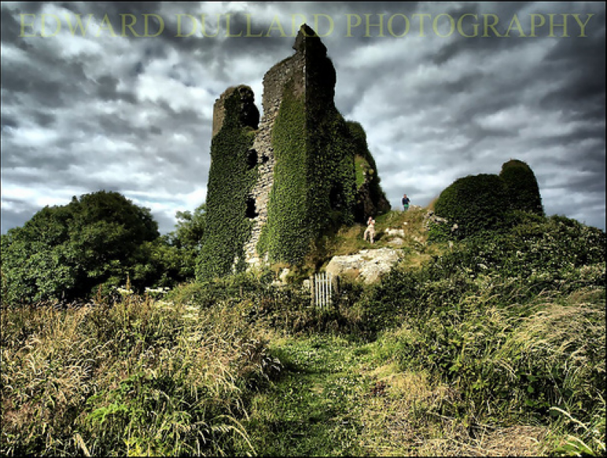
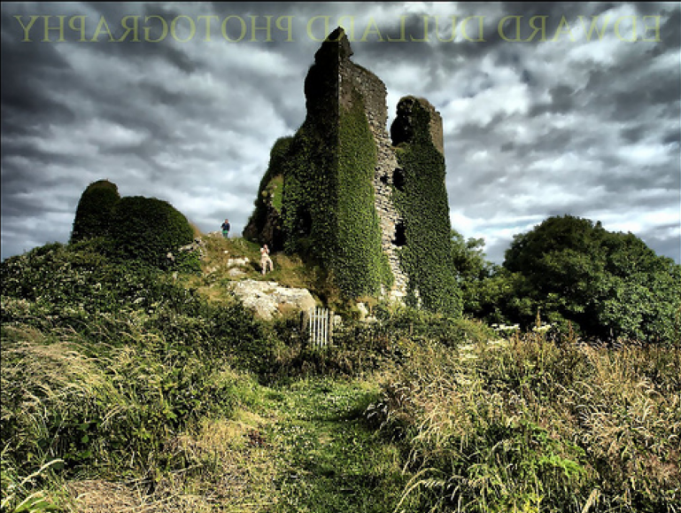
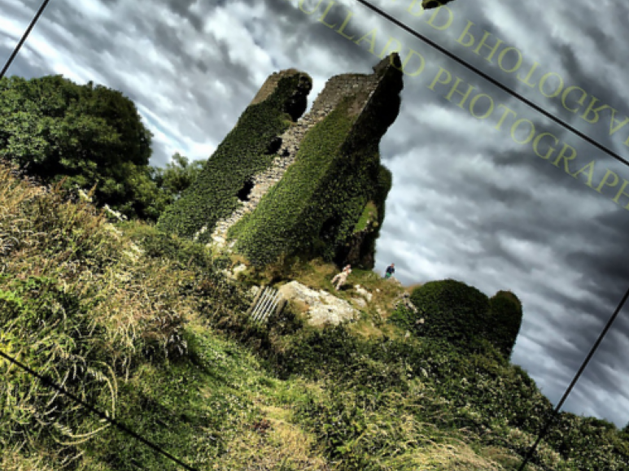
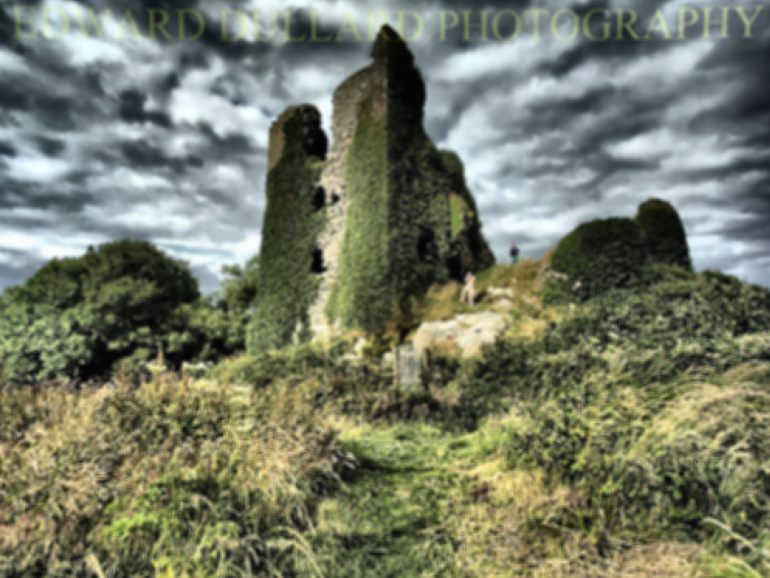
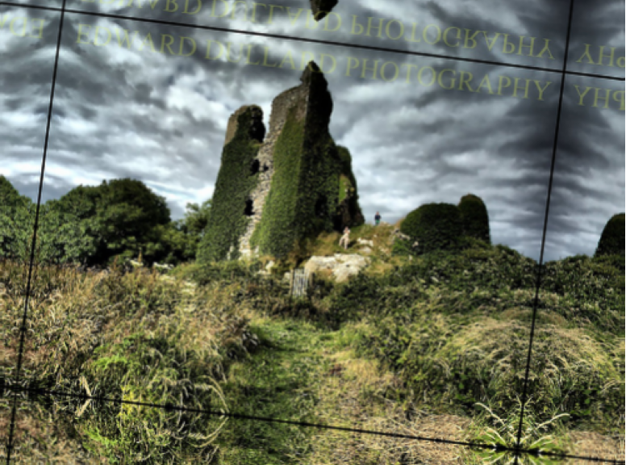

这个例子展示了如何使用Albumentations来定义一个简单的图像增强pipeline。

# 导入需要的库

```python
import random
import cv2
import matplotlib.pyplot as plt
import albumentations as A
```

# 定义可视化函数

```python
def visualize(image):
    plt.figure(figsize=(10,10))
    plt.axis('off')
    plt.imshow(image)
```

# 读取图片并转换色彩空间

由于历史原因，OpenCV读取BGR格式的图像（因此图像的颜色通道具有以下顺序：蓝色、绿色、红色）。Albumentations 使用最常见和最流行的RGB图像格式。因此，当使用OpenCV时，我们需要明确地将图像格式转换为RGB。

```python
image=cv2.imread("/home/bocheng/data/images/reverse_image_search/train/castle/n02980441_37573.JPEG")
image = cv2.cvtColor(image, cv2.COLOR_BGR2RGB)
visualize(image)
```



# 定义单个增强操作

为了可视化的目的，我们固定了随机种子，因此增强总是会产生相同的结果。在真实的计算机视觉管道中，在对图像应用变换之前，不应该修复随机种子，因为在这种情况下，管道将始终输出相同的图像。图像增强的目的是每次使用不同的变换。

```python
transform=A.HorizontalFlip(p=0.5)
random.seed(7)
augmented_image=transform(image=image)['image']
visualize(augmented_image)
```



```
transform=A.ShiftScaleRotate(p=0.5) #仿射变换：平移、缩放和旋转
random.seed(7)
augmented_image=transform(image=image)['image']
visualize(augmented_image)
```



# 定义图像增强pipeline

```python
transform=A.Compose(
   [ A.CLAHE(), #直方图均衡化
    A.RandomRotate90(), #随机旋转90度，0次或者多次
    A.Transpose(), #行列转置
    A.ShiftScaleRotate(shift_limit=0.0625,scale_limit=0.50,rotate_limit=45,p=.75), #随机仿射变换
    A.Blur(blur_limit=3), #使用随机大小的核对输入图像进行模糊处理
    A.OpticalDistortion(), #光学畸变
    A.GridDistortion(), #网格畸变
    A.HueSaturationValue() #随机改变图片的 HUE、饱和度和值
    ,]
)
random.seed(42)
augmented_image=transform(image=image)['image']
visualize(augmented_image)
```



```python
transform = A.Compose([
        A.RandomRotate90(),
        A.Flip(), #将输入进行水平翻转、垂直翻转或同时进行水平和垂直翻转。
        A.Transpose(),
        A.OneOf([
            A.IAAAdditiveGaussianNoise(), #添加高斯噪声，方法已经过时
            A.GaussNoise(),#添加高斯噪声
        ], p=0.2),
        A.OneOf([
            A.MotionBlur(p=.2), #使用随机大小的核对输入图像应用运动模糊。
            A.MedianBlur(blur_limit=3, p=0.1), #使用具有随机孔径线性大小的中值滤波器对输入图像进行模糊处理。
            A.Blur(blur_limit=3, p=0.1), #使用随机大小的核对输入图像进行模糊处理。
        ], p=0.2),
        A.ShiftScaleRotate(shift_limit=0.0625, scale_limit=0.2, rotate_limit=45, p=0.2),
        A.OneOf([
            A.OpticalDistortion(p=0.3),
            A.GridDistortion(p=.1),
            A.IAAPiecewiseAffine(p=0.3), #畸变
        ], p=0.2),
        A.OneOf([
            A.CLAHE(clip_limit=2),
            A.IAASharpen(), #对图像进行锐化处理
            A.IAAEmboss(), #浮雕效果
            A.RandomBrightnessContrast(),  #随机调整图像的亮度和对比度           
        ], p=0.3),
        A.HueSaturationValue(p=0.3), #调整图像的色调、饱和度和值（亮度）
    ])
random.seed(42) 
augmented_image = transform(image=image)['image']
visualize(augmented_image)
```




原文：[Defining a simple augmentation pipeline for image augmentation - Albumentations Documentation](https://albumentations.ai/docs/examples/example/)