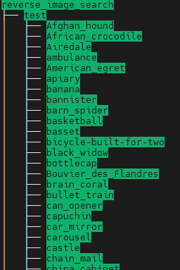
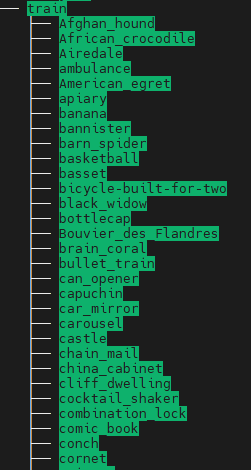

确保已经安装了以下python库

```python
pip install transformers datasets evaluate
```

# 数据预处理

训练数据和测试数据按照图片类别放置在文件夹中，如下图所示：





在训练之前需要对图片进行增强处理

```python
class DataProcessor(object):
    def __init__(self, images_dir, model_name, model_cache_dir) -> None:
        mydataset = load_dataset("imagefolder", data_dir=images_dir)  # 训练数据图片所在文件夹
        self.labels = mydataset["train"].features["label"].names
        self.image_processor = AutoImageProcessor.from_pretrained(
            model_name, cache_dir=model_cache_dir
        )
        self.get_id2label()
        self.get_transform()
        self.dataset = mydataset.with_transform(self.transforms)

        self.data_collator = DefaultDataCollator()

    def get_id2label(self):
        label2id, id2label = dict(), dict()
        for i, label in enumerate(self.labels):
            label2id[label] = str(i)
            id2label[str(i)] = label
        self.label2id = label2id
        self.id2label = id2label

    def transforms(self, examples):
        examples["pixel_values"] = [
            self._transforms(img.convert("RGB")) for img in examples["image"]
        ]
        del examples["image"]
        return examples

    def get_transform(self):
        normalize = Normalize(
            mean=self.image_processor.image_mean, std=self.image_processor.image_std
        )
        size = (
            self.image_processor.size["shortest_edge"]
            if "shortest_edge" in self.image_processor.size
            else (
                self.image_processor.size["height"],
                self.image_processor.size["width"],
            )
        )
        _transforms = Compose([RandomResizedCrop(size), ToTensor(), normalize])
        self._transforms = _transforms

```


# 模型训练和测试

```python
from dataset_process import DataProcessor
import evaluate
import numpy as np

model_name = "google/vit-base-patch16-224-in21k"  # 使用的模型
model_cache_dir = "/data/bocheng/huggingface/model/"  # 离线下载的模型保存目录
images_dir = "/data/bocheng/cv-data/reverse_image_search"  # 训练数据
dataProcessor = DataProcessor(images_dir, model_name, model_cache_dir)

# 离线加载评估模块，将相应的accuracy.py和accuracy.json放到accuracy目录下即可
accuracy = evaluate.load("/data/bocheng/huggingface/evaluate/accuracy")  # 评估指标


def compute_metrics(eval_pred):
    predictions, labels = eval_pred
    predictions = np.argmax(predictions, axis=1)
    return accuracy.compute(predictions=predictions, references=labels)


from transformers import AutoModelForImageClassification, TrainingArguments, Trainer

model = AutoModelForImageClassification.from_pretrained(
    model_name,
    num_labels=len(dataProcessor.labels),
    id2label=dataProcessor.id2label,
    label2id=dataProcessor.label2id,
    cache_dir=model_cache_dir,
)

training_args = TrainingArguments(
    output_dir="./output",
    remove_unused_columns=False,
    evaluation_strategy="epoch",
    learning_rate=5e-5,
    per_device_train_batch_size=16,
    gradient_accumulation_steps=4,
    per_device_eval_batch_size=16,
    num_train_epochs=3,
    warmup_ratio=0.1,
    logging_steps=10,
    load_best_model_at_end=True,
    metric_for_best_model="accuracy",
    save_strategy="epoch",
)

trainer = Trainer(
    model=model,
    args=training_args,
    data_collator=dataProcessor.data_collator,
    train_dataset=dataProcessor.dataset["train"],
    eval_dataset=dataProcessor.dataset["test"],
    tokenizer=dataProcessor.image_processor,
    compute_metrics=compute_metrics,
)
trainer.train()

```


# 模型推理

```python
from dataset_process import MyDataset
from transformers import pipeline, AutoModelForImageClassification

checkpoint = "google/vit-base-patch16-224-in21k"
cache_dir = "/data/bocheng/huggingface/model/"
images_dir = "/data/bocheng/cv-data/reverse_image_search"
dataset = MyDataset(
    images_dir=images_dir, checkpoint=checkpoint, model_cache_dir=cache_dir
)
test_dataset = dataset.dataset["test"]
print(test_dataset[0])

checkpoint_dir = "./output/checkpoint-48"
model = AutoModelForImageClassification.from_pretrained(
    checkpoint_dir,
)
test_image_path = "/home/bocheng/data/images/reverse_image_search/test/Afghan_hound/n02088094_4261.JPEG"
classifier = pipeline(
    "image-classification", image_processor=dataset.image_processor, model=model
)
from PIL import Image


print(classifier(Image.open(test_image_path)))

```


github代码：[CV-Learning/ImageClassification/VIT at main · chongzicbo/CV-Learning (github.com)](https://github.com/chongzicbo/CV-Learning/tree/main/ImageClassification/VIT)

参考：[Image classification (huggingface.co)](https://huggingface.co/docs/transformers/tasks/image_classification)
