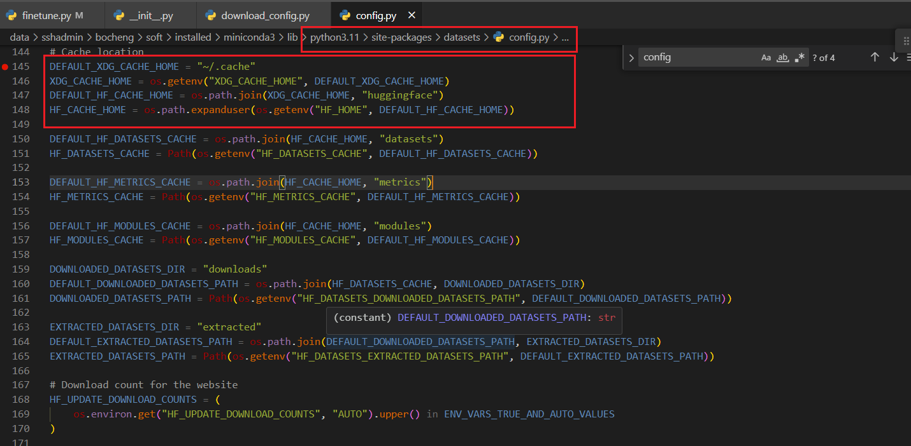

huggingface的transformers和dataset等库都默认把模型或者数据集下载保存到~/.cache目录下，但是模型或者数据集通常都比较大，占用home目录空间，这里就讲下如何设置数据集或者模型的下载保存的目录。

以datasets库数据集下载为例。datasets数据集下载的相关配置在datasets.config.py模块中，如下图：



变量DEFAULT_XDG_CACHE_HOME="~/.cache",如果没有设置环境变量"XDG_CACHE_HOME"，则数据集默认保存在"~/.cache"目录下，因此，可以通过设置环境变量的方式修改数据集下载目录，如下：

```python
"""
Descripttion: chengbo's code
version: 1.0.0
Author: chengbo
Date: 2023-10-30 12:06:23
LastEditors: chengbo
LastEditTime: 2023-10-30 12:06:30
"""
import os

#修改环境变量要在导入datasets或者transformers模块之前
os.environ["XDG_CACHE_HOME"] = "/data/.cache"  
# os.environ["HF_CACHE_HOME"] = "/data/huggingface"
# os.environ["HF_DATASETS_CACHE"] = "/data/huggingface/datasets"
from datasets import load_dataset, DownloadConfig
import datasets


dataset = load_dataset(
    "Graphcore/vqa",
    download_config=DownloadConfig(resume_download=True),
    split="validation[:200]",
)
print(dataset[0])
print(os.getenv("XDG_CACHE_HOME"))
print(os.getenv("HF_HOME"))
print(datasets.config.HF_CACHE_HOME)
print(datasets.config.HF_DATASETS_CACHE)
print(datasets.config.EXTRACTED_DATASETS_PATH)

```

通过os.environ["XDG_CACHE_HOME"] = "/data/.cache" 代码，后续的模型和数据集都会下载到该目录下。


另外一种修改模型或者数据集下载目录的方式是通过参数配置。

```python
load_dataset("Graphcore/vqa",cache_dir="/data/.cache")
```

但是这种方式有个缺点，有些数据集下载的是个压缩文件，如.zip,下载后会进行自动解压，解压的默认目录还是在"~/.cache"目录下。从上面的图片中可以看到有个EXTRACTED_DATASETS_PATH 参数，这个参数就是设置解压的目录，可以通过修改该参数来配置解压后保存的目录。

其它参数也可以参考上图config.py模块中的代码进行设置。


