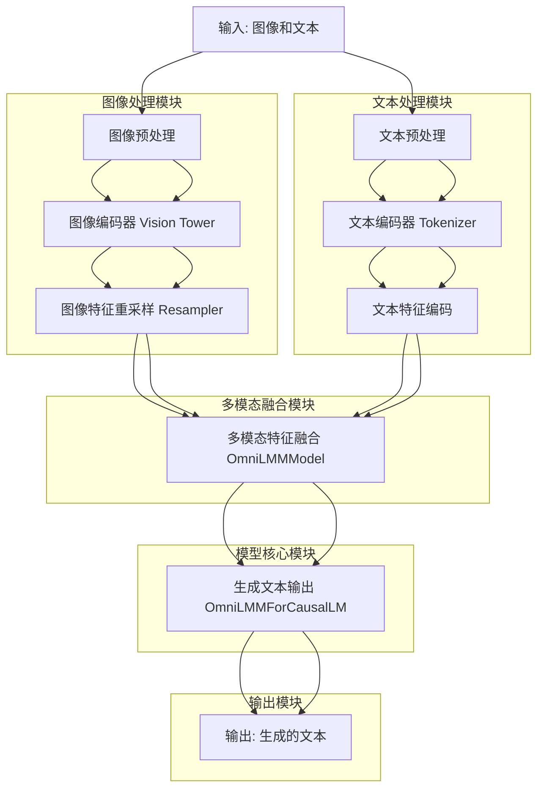

MiniCPM-V 是一个多模态大模型项目，旨在处理图像和文本的联合任务。

## 1. **项目整体架构**
MiniCPM-V 项目主要由以下几个部分组成：
- **模型核心模块**：负责处理多模态输入（图像和文本），并生成相应的输出。
- **数据处理模块**：负责预处理图像和文本数据，将其转换为模型可以处理的格式。
- **训练模块**：负责模型的训练和优化。
- **推理模块**：负责模型的推理和生成。
- **工具模块**：提供一些辅助功能，如日志记录、图像处理等。

## 2. **功能模块及其作用**

### 2.1 **模型核心模块**
- **`omnilmm.py`**:
  - 这是模型的核心实现文件，定义了 `OmniLMMForCausalLM` 和 `OmniLMMModel` 类。
  - `OmniLMMModel` 继承自 `MistralModel`，负责处理多模态输入（图像和文本），并生成相应的隐藏状态。
  - `OmniLMMForCausalLM` 继承自 `MistralForCausalLM`，负责生成文本输出。
  - 该模块还包含了图像编码器（`vision_tower`）和重采样器（`Resampler`），用于处理图像输入。

- **`resampler.py`**:
  - 定义了 `Resampler` 类，用于对图像特征进行重采样，以便与文本特征进行融合。
  - 该模块使用了多头注意力机制（`MultiheadAttention`）来处理图像特征。

### 2.2 **数据处理模块**
- **`train_utils.py`**:
  - 包含了数据预处理函数 `omni_preprocess`，用于将对话数据转换为模型可以处理的格式。
  - 该模块还定义了如何处理图像和文本的联合输入，并生成相应的 `input_ids` 和 `labels`。

- **`utils.py`**:
  - 提供了一些图像处理的工具函数，如 `build_transform`，用于构建图像预处理管道。
  - 还包含了一些辅助函数，如 `img2b64` 用于将图像转换为 base64 编码。

### 2.3 **训练模块**
- **`train_utils.py`**:
  - 包含了训练过程中使用的工具函数，如 `omni_preprocess`，用于处理训练数据。
  - 该模块还定义了如何处理多模态输入，并生成相应的损失函数。

### 2.4 **推理模块**
- **`chat.py`**:
  - 这是项目的推理模块，负责加载模型并进行推理。
  - 定义了 `OmniLMM12B` 类，用于处理图像和文本的联合输入，并生成相应的输出。
  - 该模块还包含了 `MiniCPMV`、`MiniCPMV2_5` 和 `MiniCPMV2_6` 类，用于不同版本的模型推理。

### 2.5 **工具模块**
- **`constants.py`**:
  - 定义了一些常量，如心跳间隔时间、日志目录等。

- **`conversation.py`**:
  - 定义了 `Conversation` 类，用于管理对话历史记录。
  - 该模块还定义了一些预定义的对话模板，如 `conv_v1`、`conv_v1_2` 等。

- **`utils.py`**:
  - 提供了一些通用的工具函数，如日志记录、图像处理、数据转换等。

## 3. **模块之间的交互**
- **模型核心模块**（`omnilmm.py` 和 `resampler.py`）负责处理多模态输入，并生成相应的输出。
- **数据处理模块**（`train_utils.py` 和 `utils.py`）负责将原始数据（图像和文本）转换为模型可以处理的格式。
- **训练模块**（`train_utils.py`）使用数据处理模块的输出进行模型训练。
- **推理模块**（`chat.py`）使用模型核心模块进行推理，并生成最终的输出。
- **工具模块**（`constants.py` 和 `conversation.py`）提供了一些辅助功能，如日志记录、对话管理等。

## 4. **主要功能**
- **多模态输入处理**：项目能够处理图像和文本的联合输入，并生成相应的输出。
- **对话管理**：项目能够管理对话历史记录，并根据对话历史生成相应的输出。
- **模型训练**：项目提供了训练多模态模型的工具和函数。
- **模型推理**：项目提供了推理接口，能够根据输入的图像和文本生成相应的输出。

### 5. **总结**
MiniCPM-V 是一个多模态大模型项目，能够处理图像和文本的联合任务。项目的主要模块包括模型核心模块、数据处理模块、训练模块、推理模块和工具模块。每个模块都有其特定的功能，模块之间通过数据流进行交互，共同完成多模态任务的处理。

## 5. **整体结构**

### 流程图说明

1. **输入: 图像和文本**
   - 输入包括图像和文本数据，图像通过图像预处理模块处理，文本通过文本预处理模块处理。

2. **图像预处理**
   - 图像预处理模块对输入的图像进行预处理，包括缩放、裁剪、归一化等操作。
   - 处理后的图像传递给图像编码器（Vision Tower）。

3. **图像编码器 (Vision Tower)**
   - 图像编码器将预处理后的图像转换为图像特征。
   - 图像特征传递给图像特征重采样器（Resampler）。

4. **图像特征重采样 (Resampler)**
   - 图像特征重采样器对图像特征进行重采样，以便与文本特征进行融合。
   - 重采样后的图像特征传递给多模态特征融合模块（OmniLMMModel）。

5. **文本预处理**
   - 文本预处理模块对输入的文本进行分词、编码等操作。
   - 处理后的文本传递给文本编码器（Tokenizer）。

6. **文本编码器 (Tokenizer)**
   - 文本编码器将预处理后的文本转换为文本特征。
   - 文本特征传递给多模态特征融合模块（OmniLMMModel）。

7. **多模态特征融合 (OmniLMMModel)**
   - 多模态特征融合模块将图像特征和文本特征进行融合，生成联合特征。
   - 联合特征传递给生成文本输出模块（OmniLMMForCausalLM）。

8. **生成文本输出 (OmniLMMForCausalLM)**
   - 生成文本输出模块根据联合特征生成文本输出。
   - 生成的文本传递给输出模块。

9. **输出: 生成的文本**
   - 输出模块将生成的文本输出给用户。

### 类及相关组件的作用

- **图像预处理模块**：负责对输入的图像进行预处理，包括缩放、裁剪、归一化等操作。
- **图像编码器 (Vision Tower)**：将预处理后的图像转换为图像特征。
- **图像特征重采样器 (Resampler)**：对图像特征进行重采样，以便与文本特征进行融合。
- **文本预处理模块**：负责对输入的文本进行分词、编码等操作。
- **文本编码器 (Tokenizer)**：将预处理后的文本转换为文本特征。
- **多模态特征融合模块 (OmniLMMModel)**：将图像特征和文本特征进行融合，生成联合特征。
- **生成文本输出模块 (OmniLMMForCausalLM)**：根据联合特征生成文本输出。
- **输出模块**：将生成的文本输出给用户。

文章合集：[chongzicbo/ReadWriteThink: 博学而笃志，切问而近思 (github.com)](https://github.com/chongzicbo/ReadWriteThink/tree/main)

个人博客：[程博仕](https://chongzicbo.github.io/)

微信公众号：

