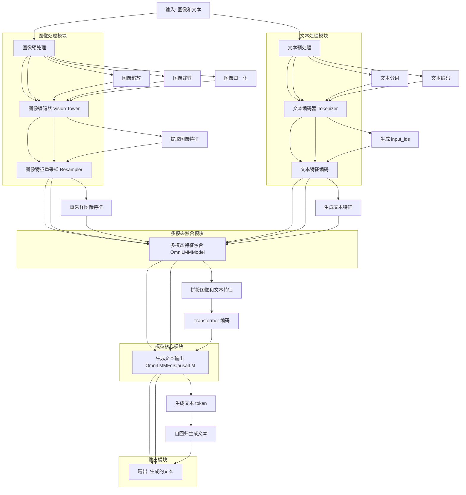
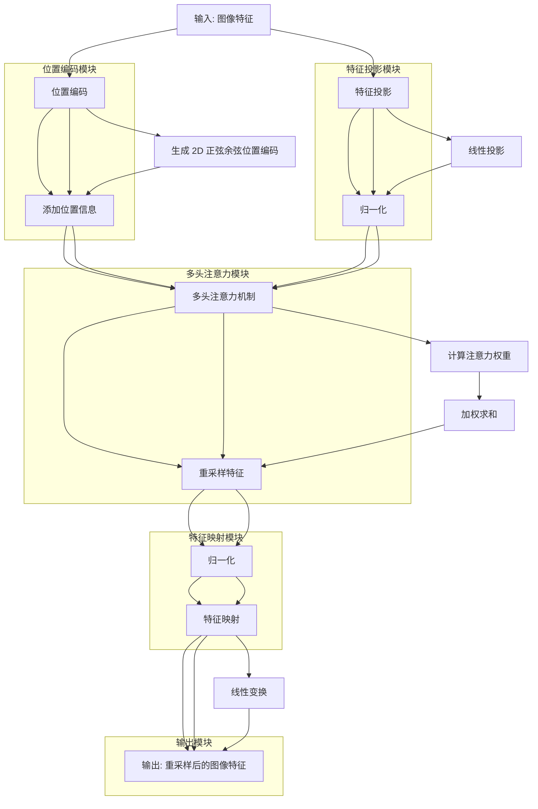
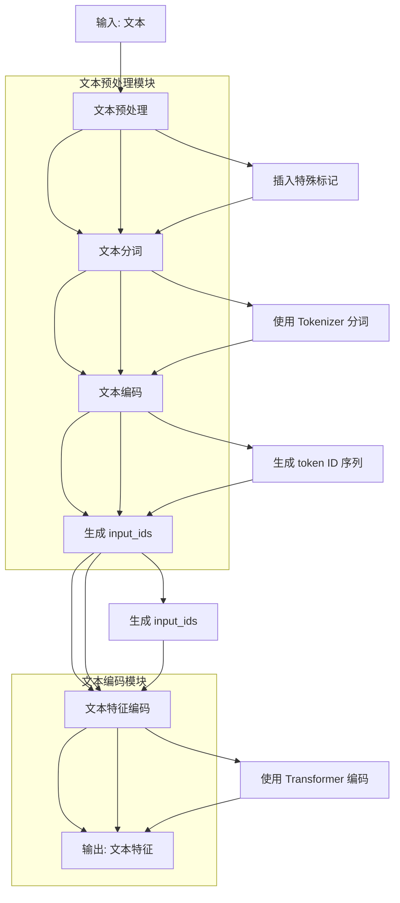
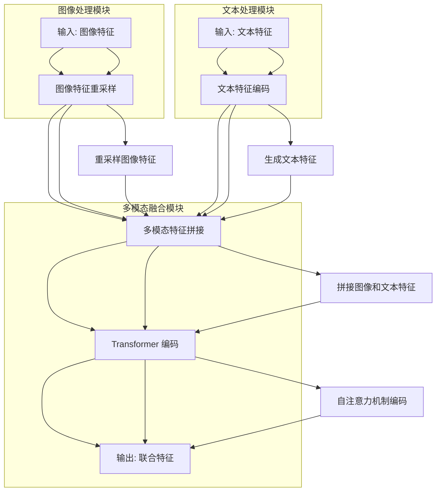
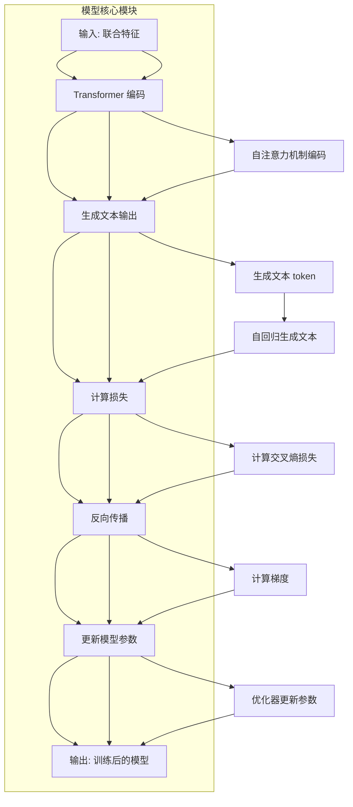

## 1. 详细训练流程




### 流程图说明

#### 1. **输入: 图像和文本**

- 输入包括图像和文本数据，分别进入图像处理模块和文本处理模块。

#### 2. **图像处理模块**

- **图像预处理**：
  - **图像缩放**：将图像调整到模型指定的输入尺寸（如 224x224）。
  - **图像裁剪**：对图像进行中心裁剪。
  - **图像归一化**：使用预定义的均值和标准差对图像进行归一化。
- **图像编码器 (Vision Tower)**：
  - 使用预训练的视觉模型（如 EVA02）提取图像特征。
- **图像特征重采样 (Resampler)**：
  - 使用多头注意力机制对图像特征进行重采样，使其与文本特征的维度匹配。

#### 3. **文本处理模块**

- **文本预处理**：
  - **文本分词**：将文本分割为 token。
  - **文本编码**：将 token 转换为 `input_ids`。
- **文本编码器 (Tokenizer)**：
  - 使用 Transformer 模型（如 Mistral）对 `input_ids` 进行编码，生成文本特征。

#### 4. **多模态融合模块**

- **多模态特征融合 (OmniLMMModel)**：
  - 将图像特征和文本特征拼接在一起，形成联合特征。
  - 使用 Transformer 的自注意力机制对联合特征进行编码。

#### 5. **模型核心模块**

- **生成文本输出 (OmniLMMForCausalLM)**：
  - 使用 `lm_head` 对联合特征进行解码，生成文本 token。
  - 通过自回归生成逐步生成文本输出。

#### 6. **输出模块**

- **输出: 生成的文本**：
  - 生成的文本被解码为自然语言，并返回给用户。

## 2. 图像处理

图像处理模块的代码主要分布在以下几个文件中：

1. **`omnilmm.py`**：定义了图像编码器（Vision Tower）和图像特征重采样器（Resampler）。
2. **`utils.py`**：定义了图像预处理函数 `build_transform`，用于对图像进行预处理。
3. **`resampler.py`**：定义了图像特征重采样器（Resampler）的实现。

### 2.1 **训练中对图像的处理**

#### 2.1.1 **图像预处理**
- **步骤**：
  1. **图像缩放**：将图像调整到模型指定的输入尺寸（如 224x224）。
  2. **图像裁剪**：对图像进行中心裁剪。
  3. **图像归一化**：使用预定义的均值和标准差对图像进行归一化。
  4. **数据增强**（可选）：在训练过程中，可能会使用随机数据增强（如随机裁剪、旋转、颜色调整等）。

- **代码**：
  ```python
  t = transforms.Compose([
      transforms.Resize((input_size, input_size), interpolation=transforms.InterpolationMode.BICUBIC),
      transforms.ToTensor(),
      transforms.Normalize(mean=mean, std=std)
  ])
  ```

#### 2.1.2 **图像编码**
- **步骤**：
  1. 使用预训练的视觉模型（如 EVA02）提取图像特征。
  2. 提取的图像特征被传递给图像特征重采样器。

- **代码**：
  ```python
  vision_tower = timm.create_model('eva02_enormous_patch14_clip_224.laion2b_plus',
                                   pretrained=False,
                                   num_classes=0,
                                   dynamic_img_size=True,
                                   dynamic_img_pad=True)
  ```

#### 2.1.3 **图像特征重采样**
- **步骤**：
  1. 使用多头注意力机制对图像特征进行重采样。
  2. 重采样后的图像特征与文本特征进行融合。

- **代码**：
  ```python
  resampler = Resampler(
      grid_size=int(math.sqrt(config.num_query)),
      embed_dim=embed_dim,
      num_heads=embed_dim // 128,
      kv_dim=vision_tower.embed_dim,
  )
  ```

---

### 2.2 **使用的图像编码器**

#### 2.2.1 **EVA02 模型**
- **模型名称**：`eva02_enormous_patch14_clip_224.laion2b_plus`
- **特点**：
  - 基于 Vision Transformer（ViT）架构。
  - 使用 CLIP 预训练权重，适合多模态任务。
  - 支持动态图像尺寸和填充。

#### 2.2.2 **图像编码器的作用**
- 将输入的图像转换为高维特征表示。
- 提取的图像特征用于与文本特征进行融合。

---

### 2.3 图像特征重采样详解(Resampler类)

在 MiniCPM-V 项目中，图像特征重采样器（Resampler）的作用是将图像编码器提取的图像特征进行重采样，使其与文本特征的维度匹配，从而便于后续的多模态特征融合。`resampler.py` 文件中定义了 `Resampler` 类的实现。以下是对图像特征重采样的详细介绍：

---

#### 2.3.1 **Resampler 的作用**

图像特征重采样器的主要作用是对图像特征进行降维或调整，使其与文本特征的维度一致。具体来说：
- 图像编码器（如 EVA02）提取的图像特征通常是高维的（例如，224x224 的图像可能生成 196 个 patch 特征，每个 patch 特征维度为 768）。
- 文本特征通常是一个序列（如 256 个 token，每个 token 维度为 768）。
- 为了将图像特征与文本特征融合，需要对图像特征进行重采样，使其维度与文本特征匹配。

---

#### 2.3.2 **Resampler 的实现**

`Resampler` 类的实现基于多头注意力机制（Multihead Attention），以下是其核心部分的详细介绍：

##### **初始化 (`__init__`)**
- **输入参数**：
  - `grid_size`：重采样后的特征网格大小（如 14x14）。
  - `embed_dim`：重采样后的特征维度（如 768）。
  - `num_heads`：注意力头的数量（如 6）。
  - `kv_dim`：键值对的维度（通常与 `embed_dim` 相同）。
  - `norm_layer`：归一化层（如 LayerNorm）。

- **初始化步骤**：
  1. 定义可学习的查询向量（`query`），用于生成重采样后的特征。
  2. 定义位置编码（`pos_embed`），用于为图像特征添加位置信息。
  3. 定义多头注意力机制（`attn`），用于对图像特征进行重采样。
  4. 定义投影矩阵（`proj`），用于将重采样后的特征映射到目标维度。

- **代码**：
  ```python
  class Resampler(nn.Module):
      def __init__(self, grid_size, embed_dim, num_heads, kv_dim=None, norm_layer=partial(nn.LayerNorm, eps=1e-6)):
          super().__init__()
          self.num_queries = grid_size ** 2
          self.embed_dim = embed_dim
          self.num_heads = num_heads
  
          self.pos_embed = nn.Parameter(
              torch.from_numpy(get_2d_sincos_pos_embed(embed_dim, grid_size)).float()
          ).requires_grad_(False)
  
          self.query = nn.Parameter(torch.zeros(self.num_queries, embed_dim))
          trunc_normal_(self.query, std=.02)
  
          if kv_dim is not None and kv_dim != embed_dim:
              self.kv_proj = nn.Linear(kv_dim, embed_dim, bias=False)
          else:
              self.kv_proj = nn.Identity()
  
          self.attn = nn.MultiheadAttention(embed_dim, num_heads)
          self.ln_q = norm_layer(embed_dim)
          self.ln_kv = norm_layer(embed_dim)
  
          self.ln_post = norm_layer(embed_dim)
          self.proj = nn.Parameter(
              (embed_dim ** -0.5) * torch.randn(embed_dim, embed_dim))
  
          self.apply(self._init_weights)
  ```

##### **前向传播 (`forward`)**
- **输入**：
  - `x`：图像特征，形状为 `(batch_size, num_patches, feature_dim)`。
  - `attn_mask`：注意力掩码（可选）。

- **处理步骤**：
  1. **位置编码**：为图像特征添加位置信息。
  2. **特征投影**：将图像特征投影到目标维度。
  3. **多头注意力**：使用可学习的查询向量对图像特征进行重采样。
  4. **特征映射**：将重采样后的特征映射到目标维度。

- **代码**：
  ```python
  def forward(self, x, attn_mask=None):
      pos_embed = get_abs_pos(self.pos_embed, x.size(1))
  
      x = self.kv_proj(x)
      x = self.ln_kv(x).permute(1, 0, 2)
  
      N = x.shape[1]
      q = self.ln_q(self.query)
      out = self.attn(
          self._repeat(q, N) + self.pos_embed.unsqueeze(1),
          x + pos_embed.unsqueeze(1),
          x,
          attn_mask=attn_mask)[0]
      x = out.permute(1, 0, 2)
  
      x = self.ln_post(x)
      x = x @ self.proj
      return x
  ```

---

#### 2.3.3 **重采样的详细过程**



#####  流程图说明

###### 1. **输入: 图像特征**

- 输入是图像编码器（如 EVA02）提取的图像特征，形状为 `(batch_size, num_patches, feature_dim)`。

###### 2. **位置编码模块**

- **生成 2D 正弦余弦位置编码**：
  - 使用 `get_2d_sincos_pos_embed` 函数生成 2D 正弦余弦位置编码。
- **添加位置信息**：
  - 将位置编码添加到图像特征中，使模型能够区分不同位置的特征。

###### 3. **特征投影模块**

- **线性投影**：
  - 使用线性层将图像特征投影到目标维度。
- **归一化**：
  - 对投影后的特征进行归一化（LayerNorm）。

###### 4. **多头注意力模块**

- **计算注意力权重**：
  - 使用可学习的查询向量（`query`）对图像特征进行注意力计算。
- **加权求和**：
  - 根据注意力权重对图像特征进行加权求和，生成重采样后的特征。

###### 5. **特征映射模块**

- **归一化**：
  - 对重采样后的特征进行归一化（LayerNorm）。
- **线性变换**：
  - 使用投影矩阵对特征进行线性变换，映射到目标维度。

###### 6. **输出: 重采样后的图像特征**

- 输出是重采样后的图像特征，形状为 `(batch_size, num_queries, embed_dim)`。

------

##### 关键组件的作用总结

| 组件               | 作用                                                   |
| :----------------- | :----------------------------------------------------- |
| **位置编码模块**   | 为图像特征添加位置信息，使模型能够区分不同位置的特征。 |
| **特征投影模块**   | 将图像特征投影到目标维度，并进行归一化。               |
| **多头注意力模块** | 使用可学习的查询向量对图像特征进行重采样。             |
| **特征映射模块**   | 对重采样后的特征进行归一化和线性变换，映射到目标维度。 |
| **输出模块**       | 输出重采样后的图像特征，用于与文本特征融合。           |

------

##### 详细步骤

1. **输入: 图像特征**
   - 输入是图像编码器提取的图像特征，形状为 `(batch_size, num_patches, feature_dim)`。
2. **位置编码模块**
   - 生成 2D 正弦余弦位置编码。
   - 将位置编码添加到图像特征中。
3. **特征投影模块**
   - 使用线性层将图像特征投影到目标维度。
   - 对投影后的特征进行归一化。
4. **多头注意力模块**
   - 使用可学习的查询向量对图像特征进行注意力计算。
   - 根据注意力权重对图像特征进行加权求和，生成重采样后的特征。
5. **特征映射模块**
   - 对重采样后的特征进行归一化。
   - 使用投影矩阵对特征进行线性变换，映射到目标维度。
6. **输出: 重采样后的图像特征**
   - 输出是重采样后的图像特征，形状为 `(batch_size, num_queries, embed_dim)`

#### 2.3.4 **重采样的输出**

- **输出形状**：`(batch_size, num_queries, embed_dim)`。
  - `num_queries`：重采样后的特征数量（如 196）。
  - `embed_dim`：重采样后的特征维度（如 768）。

- **输出用途**：
  - 重采样后的图像特征与文本特征拼接，输入到多模态融合模块（`OmniLMMModel`）中进行进一步处理。

---

#### 2.3.5 **特征重采样总结**

- **图像特征重采样器**：将图像编码器提取的高维图像特征重采样为与文本特征匹配的维度。
- **核心组件**：
  - 位置编码：为图像特征添加位置信息。
  - 多头注意力机制：对图像特征进行重采样。
  - 特征映射：将重采样后的特征映射到目标维度。
- **输出**：重采样后的图像特征用于与文本特征融合，生成多模态联合特征。

通过图像特征重采样器，MiniCPM-V 能够有效地将图像特征与文本特征融合，从而实现高质量的多模态任务处理。


### 2.4 **图像处理总结**

- **图像处理模块**：负责对图像进行预处理、编码和重采样。
- **图像预处理**：包括缩放、裁剪、归一化和数据增强。
- **图像编码器**：使用 EVA02 模型提取图像特征。
- **图像特征重采样**：使用多头注意力机制对图像特征进行重采样，使其与文本特征匹配。


## 3. 输入文本处理

### 3.1 **文本处理流程图**



---

### 3.2 **文本处理的详细梳理**

#### 3.2.1 **输入: 文本**
- 输入是一个对话格式的列表，包含用户和助手的对话轮次。例如：
  ```python
  [
      {"role": "user", "content": "What is in the image?"},
      {"role": "assistant", "content": "The image shows a cat."}
  ]
  ```

#### 3.2.2 **文本预处理**
- **插入特殊标记**：
  - 如果文本中包含 `<image>` 标记，系统会将其替换为图像的特征表示（如 `<im_start><im_patch>*N<im_end>`，其中 `N` 是图像特征的长度）。
  - 插入特殊标记（如 `<im_start>` 和 `<im_end>`）来表示图像的位置。
- **生成对话模板**：
  - 使用 `tokenizer.apply_chat_template` 函数将对话格式的文本转换为模型可以处理的格式。

- **代码**：
  ```python
  def omni_preprocess(sources, tokenizer: transformers.PreTrainedTokenizer, generation=False):
      system_content = 'You are an artificial intelligence assistant, which gives helpful, detailed, and polite answers to the human\'s questions.'
      ignore_index = -100
  
      response_template = '\n<|assistant|>\n'
      instruction_template = '\n<|user|>\n'
      response_token_ids = tokenizer.encode(response_template, add_special_tokens=False)
      instruction_token_ids = tokenizer.encode(instruction_template, add_special_tokens=False)
  
      batch_input_ids = []
      batch_labels = []
      for i in range(len(sources)):
          new_source = []
          prev_role = 'unexpect'
          for conv_turn in sources[i]:
              role = conv_turn['from'] if 'from' in conv_turn else conv_turn['role']
              content = conv_turn['value'] if 'value' in conv_turn else conv_turn['content']
  
              role = 'user' if role == 'human' else role
              role = 'assistant' if role == 'gpt' else role
  
              assert role in ['user', 'assistant']
              assert role != prev_role, f'role={role}, prev_role={prev_role}'
              prev_role = role
  
              new_turn = {
                  'role': role,
                  'content': content
              }
              new_source.append(new_turn)
          if new_source[0]['role'] != 'system':
              new_source.insert(0, {'role': 'system', 'content': system_content})
  
          res_text = tokenizer.apply_chat_template(new_source, tokenize=False, add_generation_prompt=generation)
          if not generation:
              res_text = res_text.strip()
  
          conversations_tokenized = _tokenize_fn([res_text], tokenizer)
          res_input_ids = conversations_tokenized["input_ids"][0]
          res_labels = copy.deepcopy(conversations_tokenized["labels"][0])
  
          response_token_ids_idxs = []
          human_token_ids_idxs = []
  
          for assistant_idx in np.where(res_labels == response_token_ids[0])[0]:
              if (response_token_ids == res_labels[assistant_idx: assistant_idx + len(response_token_ids)].tolist()):
                  response_token_ids_idxs.append(assistant_idx + len(response_token_ids))
  
          if len(response_token_ids_idxs) == 0:
              warnings.warn(
                  f"Could not find response key `{response_template}` in the following instance: @===>{tokenizer.decode(res_input_ids)}<===@ "
                  f'Raw text is @===>{res_text}<===@ Raw source is @===>{new_source}<===@ '
                  f"This instance will be ignored in loss calculation. "
                  f"Note, if this happens often, consider increasing the `max_seq_length`."
              )
              res_labels[:] = ignore_index
  
          human_token_ids = instruction_token_ids
          for human_idx in np.where(res_labels == human_token_ids[0])[0]:
              if human_token_ids == res_labels[human_idx: human_idx + len(human_token_ids)].tolist():
                  human_token_ids_idxs.append(human_idx)
  
          if len(human_token_ids_idxs) == 0:
              warnings.warn(
                  f"Could not find instruction key `{instruction_template}` in the following instance: @===>{tokenizer.decode(res_input_ids)}<===@ "
                  f'Raw text is @===>{res_text}<===@ Raw source is @===>{new_source}<===@ '
                  f"This instance will be ignored in loss calculation. "
                  f"Note, if this happens often, consider increasing the `max_seq_length`."
              )
              res_labels[:] = ignore_index
  
          for idx, (start, end) in enumerate(zip(human_token_ids_idxs, response_token_ids_idxs)):
              if idx != 0:
                  res_labels[start:end] = ignore_index
              else:
                  res_labels[:end] = ignore_index
  
          if len(response_token_ids_idxs) < len(human_token_ids_idxs):
              res_labels[human_token_ids_idxs[-1]:] = ignore_index
  
          batch_input_ids.append(res_input_ids)
          batch_labels.append(res_labels)
  
      return dict(input_ids=batch_input_ids, labels=batch_labels)
  ```

#### 3.2.3 **文本分词**
- **使用 Tokenizer 分词**：
  - 使用 `tokenizer` 对文本进行分词，生成 token 序列。
  - 分词过程中会插入特殊标记（如 `<im_start>` 和 `<im_end>`）。

- **代码**：
  ```python
  conversations_tokenized = _tokenize_fn([res_text], tokenizer)
  res_input_ids = conversations_tokenized["input_ids"][0]
  ```

#### 3.2.4 **文本编码**
- **生成 token ID 序列**：
  - 将分词后的 token 转换为 token ID 序列（`input_ids`）。
  - 生成 `labels`，用于模型的损失计算。

- **代码**：
  ```python
  res_input_ids = conversations_tokenized["input_ids"][0]
  res_labels = copy.deepcopy(conversations_tokenized["labels"][0])
  ```

#### 3.2.5 **文本特征编码**
- **使用 Transformer 编码**：
  - 将 `input_ids` 输入到 Transformer 模型（如 Mistral）中，生成文本特征。
  - 文本特征是一个高维向量，形状为 `(batch_size, sequence_length, hidden_dim)`。

- **代码**：
  ```python
  inputs_embeds = self.embed_tokens(data['input_ids'])
  ```

---

### 3.3 **输出: 文本特征**
- **输出形状**：`(batch_size, sequence_length, hidden_dim)`。
  - `sequence_length`：文本序列的长度。
  - `hidden_dim`：文本特征的维度（如 768）。

- **输出用途**：
  - 文本特征与图像特征拼接，输入到多模态融合模块（`OmniLMMModel`）中进行进一步处理。

---

### 3.4 **总结**

- **文本处理流程**：
  1. **文本预处理**：插入特殊标记，生成对话模板。
  2. **文本分词**：使用 `tokenizer` 对文本进行分词。
  3. **文本编码**：将分词后的 token 转换为 `input_ids`。
  4. **文本特征编码**：使用 Transformer 模型生成文本特征。
- **输出**：文本特征用于与图像特征融合，生成多模态联合特征。

## 4. 图像特征和文本特征的融合

在 MiniCPM-V 模型中，图像特征和文本特征的融合是多模态任务的核心部分。融合过程发生在 `OmniLMMModel` 中，通过将图像特征和文本特征拼接在一起，并使用 Transformer 模型进行联合编码。以下是结合源码和流程图的详细说明：

---

### 4.1 **图像特征和文本特征的融合流程图**



---

### 4.2 **融合过程的详细说明**

#### 4.2.1 **输入: 图像特征和文本特征**
- **图像特征**：
  - 来自图像特征重采样器（`Resampler`），形状为 `(batch_size, num_queries, embed_dim)`。
  - 例如：`(batch_size, 196, 768)`。
- **文本特征**：
  - 来自文本编码器（`Tokenizer` 和 Transformer），形状为 `(batch_size, sequence_length, embed_dim)`。
  - 例如：`(batch_size, 256, 768)`。

#### 4.2.2 **图像特征重采样**

- **作用**：将图像特征重采样为与文本特征匹配的维度。
- **实现**：
  - 使用 `Resampler` 对图像特征进行重采样。
  - 重采样后的图像特征形状为 `(batch_size, num_queries, embed_dim)`。

- **代码**：
  ```python
  vision_hidden_states = self.resampler(vision_embedding)
  ```

#### 4.2.3 **文本特征编码**
- **作用**：将文本输入编码为文本特征。
- **实现**：
  - 使用 `Tokenizer` 对文本进行分词和编码，生成 `input_ids`。
  - 使用 Transformer 模型对 `input_ids` 进行编码，生成文本特征。

- **代码**：
  ```python
  inputs_embeds = self.embed_tokens(data['input_ids'])
  ```

#### 4.2.4 **多模态特征拼接**
- **作用**：将图像特征和文本特征拼接在一起，形成联合特征。
- **实现**：
  - 如果文本中包含 `<image>` 标记，系统会将图像特征插入到对应的位置。
  - 拼接后的联合特征形状为 `(batch_size, sequence_length + num_queries, embed_dim)`。

- **代码**：
  ```python
  new_input_embeds = []
  cur_image_idx = 0
  for cur_input_ids, cur_input_embeds in zip(input_ids, inputs_embeds):
      if (cur_input_ids == self.vision_config.im_patch_token).sum() == 0:
          # multimodal LLM, but the current sample is not multimodal
          cur_input_embeds = cur_input_embeds + (0. * dummy_image_features).sum()
          new_input_embeds.append(cur_input_embeds)
          continue
  
      if self.vision_config.use_im_start_end:
          cur_image_features = vision_hidden_states[cur_image_idx]
          num_patches = cur_image_features.shape[0]
          if (cur_input_ids == self.vision_config.im_start_token).sum() != (cur_input_ids == self.vision_config.im_end_token).sum():
              raise ValueError("The number of image start tokens and image end tokens should be the same.")
          image_start_tokens = torch.where(cur_input_ids == self.vision_config.im_start_token)[0]
          for image_start_token_pos in image_start_tokens:
              cur_image_features = vision_hidden_states[cur_image_idx].to(device=cur_input_embeds.device)
              num_patches = cur_image_features.shape[0]
              if cur_input_ids[image_start_token_pos + num_patches + 1] != self.vision_config.im_end_token:
                  raise ValueError("The image end token should follow the image start token.")
              if orig_embeds_params is not None:
                  cur_new_input_embeds = torch.cat((cur_input_embeds[:image_start_token_pos].detach(), cur_input_embeds[image_start_token_pos:image_start_token_pos+1], cur_image_features, cur_input_embeds[image_start_token_pos + num_patches + 1:image_start_token_pos + num_patches + 2], cur_input_embeds[image_start_token_pos + num_patches + 2:].detach()), dim=0)
              else:
                  cur_new_input_embeds = torch.cat((cur_input_embeds[:image_start_token_pos+1], cur_image_features, cur_input_embeds[image_start_token_pos + num_patches + 1:]), dim=0)
              cur_image_idx += 1
          new_input_embeds.append(cur_new_input_embeds)
      else:
          raise NotImplementedError
  inputs_embeds = torch.stack(new_input_embeds, dim=0)
  ```

#### 4.2.5 **Transformer 编码**
- **作用**：对拼接后的联合特征进行编码，生成最终的联合特征。
- **实现**：
  - 使用 Transformer 的自注意力机制（Self-Attention）对联合特征进行编码。
  - 编码后的联合特征形状为 `(batch_size, sequence_length + num_queries, embed_dim)`。

- **代码**：
  ```python
  outputs = self.model(
      input_ids=input_ids, attention_mask=attention_mask, past_key_values=past_key_values,
      inputs_embeds=inputs_embeds, use_cache=use_cache,
      output_attentions=output_attentions, output_hidden_states=output_hidden_states,
      return_dict=return_dict,
      **kwargs
  )
  ```

#### 4.2.6 **输出: 联合特征**
- **输出形状**：`(batch_size, sequence_length + num_queries, embed_dim)`。
  - `sequence_length`：文本序列的长度。
  - `num_queries`：图像特征的数量。
  - `embed_dim`：特征的维度（如 768）。

- **输出用途**：
  - 联合特征用于生成文本输出（如通过 `OmniLMMForCausalLM` 生成回答）。

---

### 4.3 **总结**

- **图像特征和文本特征的融合**：
  1. **图像特征重采样**：将图像特征重采样为与文本特征匹配的维度。
  2. **文本特征编码**：将文本输入编码为文本特征。
  3. **多模态特征拼接**：将图像特征和文本特征拼接在一起，形成联合特征。
  4. **Transformer 编码**：对联合特征进行编码，生成最终的联合特征。
- **输出**：联合特征用于生成文本输出。

## 5. 模型核心模块

除了文本处理和图像处理模块外，模型核心模块（`OmniLMMModel` 和 `OmniLMMForCausalLM`）负责将多模态特征融合并生成最终的输出。

---

### 5.1 **模型核心模块的流程图**



---

### 5.2 **模型核心模块的详细说明**

#### 5.2.1 **输入: 联合特征**
- **联合特征**：
  - 来自多模态融合模块，形状为 `(batch_size, sequence_length + num_queries, embed_dim)`。
  - 例如：`(batch_size, 256 + 196, 768)`。

#### 5.2.2 **Transformer 编码**
- **作用**：对联合特征进行编码，生成隐藏状态。
- **实现**：
  - 使用 Transformer 的自注意力机制（Self-Attention）对联合特征进行编码。
  - 编码后的隐藏状态形状为 `(batch_size, sequence_length + num_queries, embed_dim)`。

- **代码**：
  ```python
  outputs = self.model(
      input_ids=input_ids, attention_mask=attention_mask, past_key_values=past_key_values,
      inputs_embeds=inputs_embeds, use_cache=use_cache,
      output_attentions=output_attentions, output_hidden_states=output_hidden_states,
      return_dict=return_dict,
      **kwargs
  )
  ```

#### 5.2.3 **生成文本输出**
- **作用**：根据隐藏状态生成文本输出。
- **实现**：
  - 使用 `lm_head` 对隐藏状态进行解码，生成文本 token。
  - 通过自回归生成逐步生成文本输出。

- **代码**：
  ```python
  hidden_states = outputs[0]
  logits = self.lm_head(hidden_states)
  ```

#### 5.2.4 **计算损失**
- **作用**：计算模型输出与真实标签之间的损失。
- **实现**：
  - 使用交叉熵损失函数（CrossEntropyLoss）计算损失。
  - 损失函数的目标是最小化模型输出与真实标签之间的差异。

- **代码**：
  ```python
  loss = None
  if labels is not None:
      shift_logits = logits[..., :-1, :].contiguous()
      shift_labels = labels[..., 1:].contiguous()
      loss_fct = CrossEntropyLoss()
      shift_logits = shift_logits.view(-1, self.config.vocab_size)
      shift_labels = shift_labels.view(-1)
      shift_labels = shift_labels.to(shift_logits.device)
      loss = loss_fct(shift_logits, shift_labels)
  ```

#### 5.2.5 **反向传播**
- **作用**：计算梯度并更新模型参数。
- **实现**：
  - 使用反向传播算法计算损失函数对模型参数的梯度。
  - 通过优化器（如 AdamW）更新模型参数。

- **代码**：
  ```python
  loss.backward()
  optimizer.step()
  ```

#### 5.2.6 **更新模型参数**
- **作用**：根据梯度更新模型参数。
- **实现**：
  - 使用优化器更新模型参数。
  - 更新后的模型参数用于下一轮训练。

- **代码**：
  ```python
  optimizer.step()
  ```

#### 5.2.7 **输出: 训练后的模型**
- **输出**：训练后的模型，可以用于推理任务。

---

### 5.3 **总结**

- **模型核心模块的训练流程**：
  1. **Transformer 编码**：对联合特征进行编码，生成隐藏状态。
  2. **生成文本输出**：根据隐藏状态生成文本输出。
  3. **计算损失**：计算模型输出与真实标签之间的损失。
  4. **反向传播**：计算梯度并更新模型参数。
  5. **更新模型参数**：根据梯度更新模型参数。
  6. **输出**：训练后的模型。


文章合集：[chongzicbo/ReadWriteThink: 博学而笃志，切问而近思 (github.com)](https://github.com/chongzicbo/ReadWriteThink/tree/main)

个人博客：[程博仕](https://chongzicbo.github.io/)

微信公众号：


