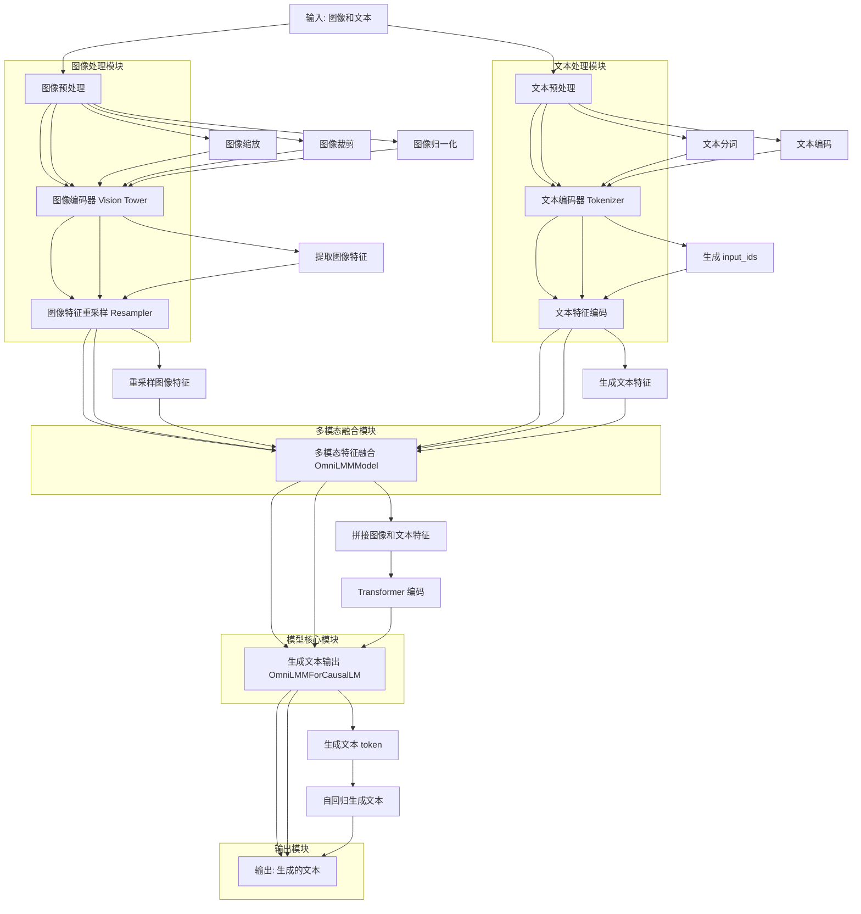

## 1. **MiniCPM-V 推理流程图**



---

## 2. **推理流程的详细说明**

### 2.1 **输入: 图像和文本**
- **输入**：
  - 图像：RGB 图像文件（如 JPEG 或 PNG）。
  - 文本：对话格式的列表，包含用户和助手的对话轮次。

### 2.2 **图像预处理**
- **步骤**：
  1. **图像缩放**：将图像调整到模型指定的输入尺寸（如 224x224）。
  2. **图像裁剪**：对图像进行中心裁剪。
  3. **图像归一化**：使用预定义的均值和标准差对图像进行归一化。

- **代码**：
  ```python
  image = Image.open(io.BytesIO(base64.b64decode(input['image']))).convert('RGB')
  image = self.image_transform(image)
  ```

### 2.3 **图像编码器 (Vision Tower)**
- **作用**：将预处理后的图像转换为图像特征。
- **实现**：
  - 使用预训练的视觉模型（如 EVA02）提取图像特征。

- **代码**：
  ```python
  vision_embedding = vision_tower.forward_features(pixel_values.type(dtype))
  ```

### 2.4 **图像特征重采样 (Resampler)**
- **作用**：对图像特征进行重采样，使其与文本特征的维度匹配。
- **实现**：
  - 使用多头注意力机制对图像特征进行重采样。

- **代码**：
  ```python
  res = self.resampler(vision_embedding)
  ```

### 2.5 **文本预处理**
- **步骤**：
  1. **文本分词**：将文本分割为 token。
  2. **文本编码**：将 token 转换为 `input_ids`。

- **代码**：
  ```python
  msgs = json.loads(input['question'])
  input_ids = wrap_question_for_omni_lmm(msgs, self.image_token_len, self.tokenizer)['input_ids']
  input_ids = torch.as_tensor(input_ids)
  ```

### 2.6 **文本编码器 (Tokenizer)**
- **作用**：将预处理后的文本转换为文本特征。
- **实现**：
  - 使用 Transformer 模型（如 Mistral）对 `input_ids` 进行编码，生成文本特征。

- **代码**：
  ```python
  inputs_embeds = self.embed_tokens(data['input_ids'])
  ```

### 2.7 **多模态特征融合 (OmniLMMModel)**
- **作用**：将图像特征和文本特征拼接在一起，形成联合特征。
- **实现**：
  - 如果文本中包含 `<image>` 标记，系统会将图像特征插入到对应的位置。
  - 拼接后的联合特征形状为 `(batch_size, sequence_length + num_queries, embed_dim)`。

- **代码**：
  ```python
  new_input_embeds = []
  cur_image_idx = 0
  for cur_input_ids, cur_input_embeds in zip(input_ids, inputs_embeds):
      if (cur_input_ids == self.vision_config.im_patch_token).sum() == 0:
          cur_input_embeds = cur_input_embeds + (0. * dummy_image_features).sum()
          new_input_embeds.append(cur_input_embeds)
          continue
  
      if self.vision_config.use_im_start_end:
          cur_image_features = vision_hidden_states[cur_image_idx]
          num_patches = cur_image_features.shape[0]
          if (cur_input_ids == self.vision_config.im_start_token).sum() != (cur_input_ids == self.vision_config.im_end_token).sum():
              raise ValueError("The number of image start tokens and image end tokens should be the same.")
          image_start_tokens = torch.where(cur_input_ids == self.vision_config.im_start_token)[0]
          for image_start_token_pos in image_start_tokens:
              cur_image_features = vision_hidden_states[cur_image_idx].to(device=cur_input_embeds.device)
              num_patches = cur_image_features.shape[0]
              if cur_input_ids[image_start_token_pos + num_patches + 1] != self.vision_config.im_end_token:
                  raise ValueError("The image end token should follow the image start token.")
              if orig_embeds_params is not None:
                  cur_new_input_embeds = torch.cat((cur_input_embeds[:image_start_token_pos].detach(), cur_input_embeds[image_start_token_pos:image_start_token_pos+1], cur_image_features, cur_input_embeds[image_start_token_pos + num_patches + 1:image_start_token_pos + num_patches + 2], cur_input_embeds[image_start_token_pos + num_patches + 2:].detach()), dim=0)
              else:
                  cur_new_input_embeds = torch.cat((cur_input_embeds[:image_start_token_pos+1], cur_image_features, cur_input_embeds[image_start_token_pos + num_patches + 1:]), dim=0)
              cur_image_idx += 1
          new_input_embeds.append(cur_new_input_embeds)
      else:
          raise NotImplementedError
  inputs_embeds = torch.stack(new_input_embeds, dim=0)
  ```

### 2.8 **生成文本输出 (OmniLMMForCausalLM)**
- **作用**：根据联合特征生成文本输出。
- **实现**：
  - 使用 `lm_head` 对联合特征进行解码，生成文本 token。
  - 通过自回归生成逐步生成文本输出。

- **代码**：
  ```python
  output = self.model.generate_vllm(
      input_ids=input_ids.unsqueeze(0).cuda(),
      images=image.unsqueeze(0).half().cuda(),
      temperature=0.6,
      max_new_tokens=1024,
      do_sample=True,
      output_scores=True,
      return_dict_in_generate=True,
      repetition_penalty=1.1,
      top_k=30,
      top_p=0.9,
  )
  response = self.tokenizer.decode(output.sequences[0], skip_special_tokens=True)
  response = response.strip()
  ```

### 2.9 **输出: 生成的文本**
- **输出**：生成的文本被返回给用户。

---

## 3. **总结**

- **推理流程**：
  1. **图像预处理**：对图像进行缩放、裁剪和归一化。
  2. **图像编码**：使用 Vision Tower 提取图像特征。
  3. **图像特征重采样**：使用 Resampler 对图像特征进行重采样。
  4. **文本预处理**：对文本进行分词和编码。
  5. **文本编码**：使用 Tokenizer 生成文本特征。
  6. **多模态特征融合**：将图像特征和文本特征拼接在一起。
  7. **生成文本输出**：使用 OmniLMMForCausalLM 生成文本输出。
  8. **输出**：生成的文本返回给用户。


文章合集：[chongzicbo/ReadWriteThink: 博学而笃志，切问而近思 (github.com)](https://github.com/chongzicbo/ReadWriteThink/tree/main)

个人博客：[程博仕](https://chongzicbo.github.io/)

微信公众号：

