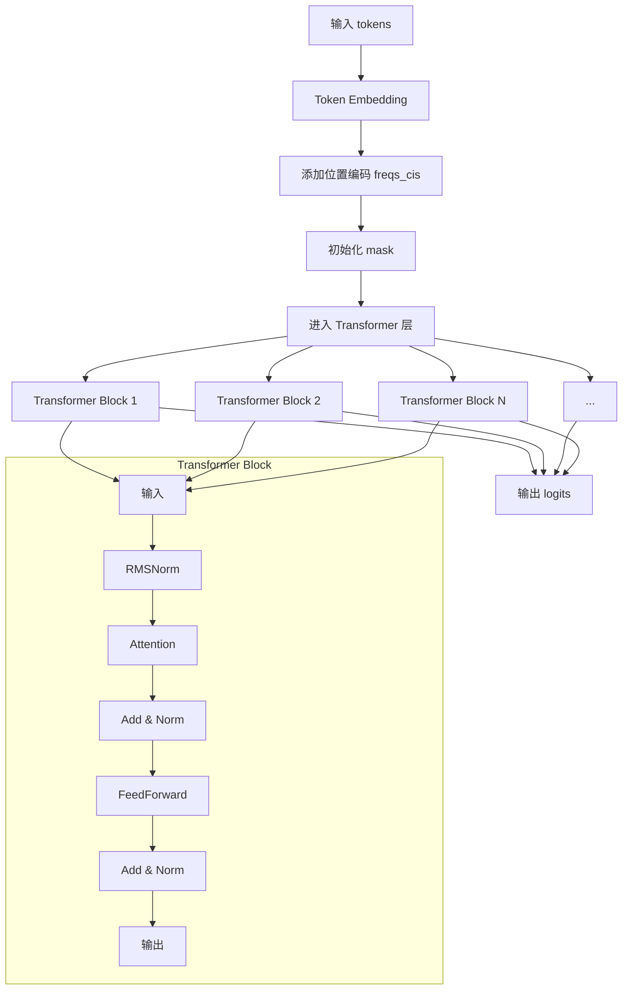
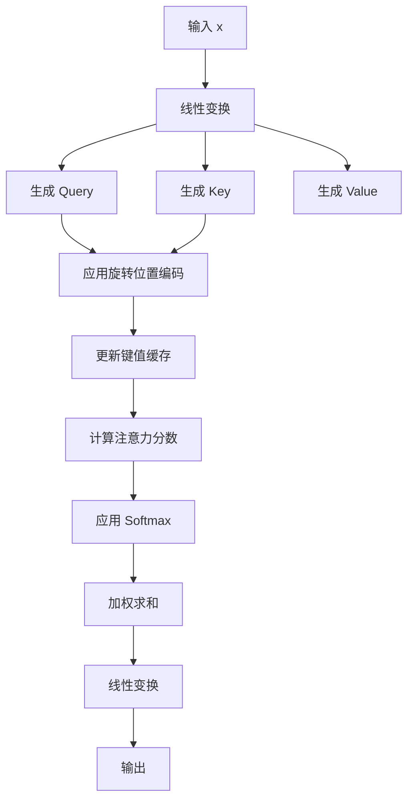
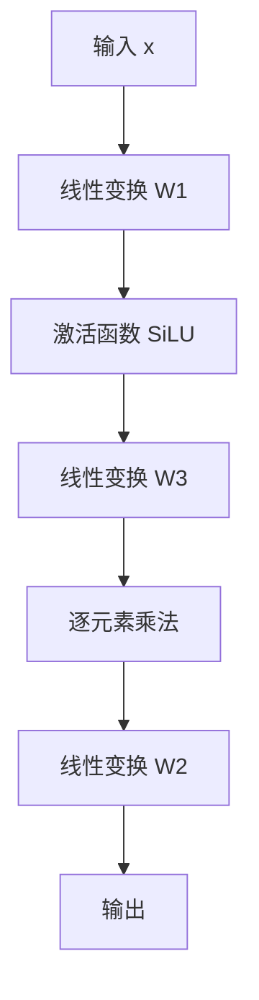
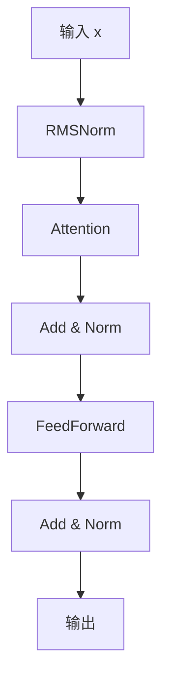
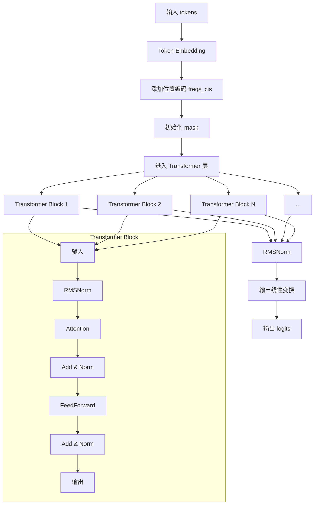

## 整体

`model.py` 模块是 Llama 3 模型的核心实现部分，主要负责定义和实现 Transformer 模型的结构及其相关组件。

### 1. **模型参数定义 (`ModelArgs` 类)**
   - `ModelArgs` 类是一个数据类，用于定义和存储模型的各种超参数，例如：
     - `dim`: 模型的维度。
     - `n_layers`: Transformer 的层数。
     - `n_heads`: 注意力机制中的头数。
     - `vocab_size`: 词汇表大小。
     - `max_batch_size`: 最大批处理大小。
     - `max_seq_len`: 最大序列长度。
   - 这些参数在模型初始化时被使用，决定了模型的结构和行为。

### 2. **RMSNorm 层 (`RMSNorm` 类)**
   - `RMSNorm` 是一个自定义的归一化层，用于替代传统的 LayerNorm。它通过对输入进行**均方根归一化**来稳定训练过程。
   - 该层在 Transformer 的每个子层（如注意力机制和前馈网络）之后使用。

### 3. **RoPE (Rotary Positional Embedding)**
   - 该模块实现了旋转位置编码（RoPE），用于为输入序列中的每个位置生成位置编码。RoPE 通过将位置信息嵌入到注意力机制中，帮助模型捕捉序列中的位置关系。
   - `precompute_freqs_cis` 函数预计算了频率矩阵，`apply_rotary_emb` 函数将旋转**位置编码应用到查询和键向量上。**

### 4. **注意力机制 (`Attention` 类)**
   - `Attention` 类实现了多头注意力机制（Multi-Head Attention），这是 Transformer 模型的核心组件之一。
   - 它使用 `ColumnParallelLinear` 和 `RowParallelLinear` 来实现并行的线性变换，支持模型并行化。
   - 该模块还实现了键值缓存（KV Cache），用于在生成过程中缓存先前的键和值，以减少重复计算。

### 5. **前馈网络 (`FeedForward` 类)**
   - `FeedForward` 类实现了 Transformer 中的前馈神经网络（FFN），通常由两个线性变换和一个激活函数（如 SiLU）组成。
   - 该模块也支持模型并行化，使用 `ColumnParallelLinear` 和 `RowParallelLinear` 来实现并行的线性变换。

### 6. **Transformer 块 (`TransformerBlock` 类)**
   - `TransformerBlock` 类将注意力机制和前馈网络组合在一起，形成一个完整的 Transformer 层。
   - 每个 Transformer 块包含一个注意力层和一个前馈网络层，并且在每个子层之后应用 RMSNorm 进行归一化。

### 7. **Transformer 模型 (`Transformer` 类)**
   - `Transformer` 类是整个模型的核心，它由多个 `TransformerBlock` 组成，形成一个深层的 Transformer 网络。
   - 该模块还负责处理输入嵌入、位置编码、以及最终的输出线性变换。
   - `forward` 方法实现了模型的前向传播过程，包括嵌入、位置编码、多层 Transformer 块的处理以及最终的输出生成。

### 8. **模型并行化**
   - 该模块使用了 `fairscale` 库中的 `ColumnParallelLinear` 和 `RowParallelLinear` 来实现模型并行化，允许模型在多个 GPU 上分布计算，从而提高训练和推理的效率。

### 9. **推理模式**
   - 在推理模式下，模型使用 `torch.inference_mode()` 来禁用梯度计算，从而提高推理速度并减少内存占用。

### 总结：
`model.py` 模块定义了 Llama 3 模型的核心架构，包括 Transformer 的各个组件（如注意力机制、前馈网络、归一化层等），并实现了模型并行化和推理优化。它是整个 Llama 3 模型的基础，负责处理输入数据并生成输出。

## 模型详细流程图



1. **输入 tokens**  
   - 输入是一个批次的 token IDs，形状为 `(batch_size, seq_len)`。

2. **Token Embedding**  
   - 通过 `tok_embeddings` 将 token IDs 转换为嵌入向量，形状为 `(batch_size, seq_len, dim)`。

3. **添加位置编码 freqs_cis**  
   - 使用预计算的 `freqs_cis` 为嵌入向量添加旋转位置编码，帮助模型捕捉序列中的位置信息。

4. **初始化 mask**  
   - 根据 `seq_len` 和 `start_pos` 生成注意力掩码 `mask`，用于防止模型看到未来的 token。

5. **进入 Transformer 层**  
   - 嵌入向量和位置编码进入多层 Transformer 块进行处理。

6. **Transformer Block 1 到 N**  
   - 每个 Transformer 块包含以下步骤：
     - **RMSNorm**: 对输入进行归一化。
     - **Attention**: 应用多头注意力机制，生成注意力输出。
     - **RMSNorm**: 对注意力输出进行归一化。
     - **FeedForward**: 应用前馈网络，生成最终的 Transformer 块输出。

7. **应用 RMSNorm**  
   - 在所有 Transformer 块处理完成后，对最终输出应用 RMSNorm 进行归一化。

8. **输出线性变换**  
   - 通过 `output` 线性层将归一化后的输出映射到词汇表空间，形状为 `(batch_size, seq_len, vocab_size)`。

9. **输出 logits**  
   - 返回最终的 logits，表示每个 token 的概率分布。


## `class ModelArgs`

```python
@dataclass
class ModelArgs:
    dim: int = 4096  # 模型的维度，即每个token的向量表示的大小
    n_layers: int = 32  # 模型的层数，即Transformer的层数
    n_heads: int = 32  # 注意力机制中的头数
    n_kv_heads: Optional[int] = None  # 键值头的数量，如果为None，则与n_heads相同
    vocab_size: int = -1  # 词汇表的大小，通常由tokenizer决定
    multiple_of: int = 256  # SwiGLU激活函数中隐藏层大小的倍数，确保是256的倍数
    ffn_dim_multiplier: Optional[float] = None  # 前馈网络维度的乘数，用于调整隐藏层大小
    norm_eps: float = 1e-5  # Layer Normalization中的epsilon值，用于数值稳定性
    rope_theta: float = 500000  # RoPE（Rotary Position Embedding）中的theta参数

    max_batch_size: int = 32  # 最大批处理大小
    max_seq_len: int = 2048  # 最大序列长度
```

## `class RMSNorm`
```python
class RMSNorm(torch.nn.Module):
    def __init__(self, dim: int, eps: float = 1e-6):
        super().__init__()
        self.eps = eps  # 用于数值稳定性的小值，防止除以零
        self.weight = nn.Parameter(torch.ones(dim))  # 可学习的缩放参数，初始化为1

    def _norm(self, x):
        # 计算RMS（Root Mean Square）归一化，对输入x进行归一化处理
        return x * torch.rsqrt(x.pow(2).mean(-1, keepdim=True) + self.eps)

    def forward(self, x):
        # 前向传播函数，先对输入x进行归一化，然后乘以可学习的缩放参数
        output = self._norm(x.float()).type_as(x)  # 归一化并保持与输入x相同的数据类型
        return output * self.weight  # 乘以缩放参数
```

### 解释：
1. **`ModelArgs`**:
   - 这是一个数据类，用于存储模型的配置参数。它定义了模型的结构和超参数，如模型的维度、层数、注意力头数等。
   - `dim` 是每个token的向量表示的大小，`n_layers` 是Transformer的层数，`n_heads` 是注意力机制中的头数。
   - `vocab_size` 是词汇表的大小，通常由tokenizer决定。
   - `multiple_of` 和 `ffn_dim_multiplier` 用于调整前馈网络的隐藏层大小。
   - `norm_eps` 是Layer Normalization中的epsilon值，用于数值稳定性。
   - `rope_theta` 是RoPE（Rotary Position Embedding）中的theta参数，用于位置编码。
   - `max_batch_size` 和 `max_seq_len` 分别定义了模型的最大批处理大小和最大序列长度。

2. **`RMSNorm`**:
   - 这是一个自定义的归一化层，类似于Layer Normalization，但使用了RMS（Root Mean Square）归一化。
   - `_norm` 方法计算输入的RMS归一化值，`forward` 方法在前向传播时对输入进行归一化并乘以可学习的缩放参数。
   - `eps` 是一个小值，用于防止除以零的情况，`weight` 是可学习的缩放参数，初始化为1。

这两个类在模型中分别用于定义模型的结构和实现归一化操作，是Transformer模型的重要组成部分。


---

## 旋转位置编码

### **`precompute_freqs_cis`**

```python
def precompute_freqs_cis(dim: int, end: int, theta: float = 10000.0):
    """
    预计算旋转位置编码的频率矩阵 (freqs_cis)。

    旋转位置编码 (Rotary Positional Embedding, RoPE) 是一种将位置信息嵌入到注意力机制中的方法。
    它通过将位置信息编码为复数形式，应用到查询和键向量上。

    参数:
        dim (int): 模型的维度（通常是注意力头的维度）。
        end (int): 序列的最大长度。
        theta (float): 控制频率的基数，默认为 10000.0。

    返回:
        freqs_cis (torch.Tensor): 预计算的频率矩阵，形状为 (end, dim // 2)，数据类型为 complex64。
    """
    # 计算频率向量
    freqs = 1.0 / (theta ** (torch.arange(0, dim, 2)[: (dim // 2)].float() / dim))
    # 生成位置向量
    t = torch.arange(end, device=freqs.device, dtype=torch.float32)
    # 计算外积，得到频率矩阵
    freqs = torch.outer(t, freqs)
    # 将频率矩阵转换为复数形式（极坐标表示）
    freqs_cis = torch.polar(torch.ones_like(freqs), freqs)  # complex64
    return freqs_cis
```

#### 解释：
- **作用**: 预计算旋转位置编码的频率矩阵 `freqs_cis`，用于将位置信息嵌入到查询和键向量中。
- **输入**:
  - `dim`: 模型的维度，通常是注意力头的维度。
  - `end`: 序列的最大长度。
  - `theta`: 控制频率的基数，默认为 10000.0。
- **输出**:
  - `freqs_cis`: 预计算的频率矩阵，形状为 `(end, dim // 2)`，数据类型为 `complex64`。
- **关键点**:
  - 使用 `torch.outer` 计算位置向量和频率向量的外积，得到频率矩阵。
  - 通过 `torch.polar` 将频率矩阵转换为复数形式，表示极坐标。

---

### **`reshape_for_broadcast`**
```python
def reshape_for_broadcast(freqs_cis: torch.Tensor, x: torch.Tensor):
    """
    将频率矩阵 `freqs_cis` 重塑为适合广播的形状，以便与查询或键向量进行逐元素操作。

    参数:
        freqs_cis (torch.Tensor): 频率矩阵，形状为 (seq_len, dim // 2)。
        x (torch.Tensor): 查询或键向量，形状为 (batch_size, seq_len, n_heads, head_dim)。

    返回:
        freqs_cis (torch.Tensor): 重塑后的频率矩阵，形状为 (1, seq_len, 1, dim // 2)。
    """
    ndim = x.ndim
    assert 0 <= 1 < ndim
    assert freqs_cis.shape == (x.shape[1], x.shape[-1])
    # 重塑频率矩阵，使其形状为 (1, seq_len, 1, dim // 2)
    shape = [d if i == 1 or i == ndim - 1 else 1 for i, d in enumerate(x.shape)]
    return freqs_cis.view(*shape)
```

#### 解释：
- **作用**: 将频率矩阵 `freqs_cis` 重塑为适合广播的形状，以便与查询或键向量进行逐元素操作。
- **输入**:
  - `freqs_cis`: 频率矩阵，形状为 `(seq_len, dim // 2)`。
  - `x`: 查询或键向量，形状为 `(batch_size, seq_len, n_heads, head_dim)`。
- **输出**:
  - 重塑后的频率矩阵，形状为 `(1, seq_len, 1, dim // 2)`。
- **关键点**:
  - 通过 `view` 方法将频率矩阵重塑为适合广播的形状，使其能够与查询或键向量进行逐元素操作。

---

### **`apply_rotary_emb`**
```python
def apply_rotary_emb(
    xq: torch.Tensor,
    xk: torch.Tensor,
    freqs_cis: torch.Tensor,
) -> Tuple[torch.Tensor, torch.Tensor]:
    """
    将旋转位置编码应用到查询和键向量上。

    旋转位置编码通过将位置信息嵌入到查询和键向量中，帮助模型捕捉序列中的位置关系。

    参数:
        xq (torch.Tensor): 查询向量，形状为 (batch_size, seq_len, n_heads, head_dim)。
        xk (torch.Tensor): 键向量，形状为 (batch_size, seq_len, n_heads, head_dim)。
        freqs_cis (torch.Tensor): 频率矩阵，形状为 (1, seq_len, 1, head_dim // 2)。

    返回:
        xq_out (torch.Tensor): 应用旋转位置编码后的查询向量。
        xk_out (torch.Tensor): 应用旋转位置编码后的键向量。
    """
    # 将查询和键向量转换为复数形式
    xq_ = torch.view_as_complex(xq.float().reshape(*xq.shape[:-1], -1, 2))
    xk_ = torch.view_as_complex(xk.float().reshape(*xk.shape[:-1], -1, 2))
    # 重塑频率矩阵以匹配查询和键向量的形状
    freqs_cis = reshape_for_broadcast(freqs_cis, xq_)
    # 应用旋转位置编码
    xq_out = torch.view_as_real(xq_ * freqs_cis).flatten(3)
    xk_out = torch.view_as_real(xk_ * freqs_cis).flatten(3)
    return xq_out.type_as(xq), xk_out.type_as(xk)
```

#### 解释：
- **作用**: 将旋转位置编码应用到查询和键向量上，帮助模型捕捉序列中的位置关系。
- **输入**:
  - `xq`: 查询向量，形状为 `(batch_size, seq_len, n_heads, head_dim)`。
  - `xk`: 键向量，形状为 `(batch_size, seq_len, n_heads, head_dim)`。
  - `freqs_cis`: 频率矩阵，形状为 `(1, seq_len, 1, head_dim // 2)`。
- **输出**:
  - `xq_out`: 应用旋转位置编码后的查询向量。
  - `xk_out`: 应用旋转位置编码后的键向量。
- **关键点**:
  - 使用 `torch.view_as_complex` 将查询和键向量转换为复数形式。
  - 通过逐元素乘法将频率矩阵应用到查询和键向量上。
  - 使用 `torch.view_as_real` 将结果转换回实数形式。
  
  
  
  这些函数共同实现了旋转位置编码（RoPE）
  
  ### 总结：
  
  - **`precompute_freqs_cis`**: 预计算旋转位置编码的频率矩阵。
  - **`reshape_for_broadcast`**: 将频率矩阵重塑为适合广播的形状。
  - **`apply_rotary_emb`**: 将旋转位置编码应用到查询和键向量上。

---

## **`repeat_kv`**
```python
def repeat_kv(x: torch.Tensor, n_rep: int) -> torch.Tensor:
    """
    重复键或值向量，以匹配查询向量的头数。

    在分组注意力机制中，键和值向量的头数可能少于查询向量的头数，因此需要重复键和值向量以匹配查询向量的头数。

    参数:
        x (torch.Tensor): 键或值向量，形状为 (batch_size, seq_len, n_kv_heads, head_dim)。
        n_rep (int): 重复次数，通常为查询头数与键值头数的比值。

    返回:
        torch.Tensor: 重复后的键或值向量，形状为 (batch_size, seq_len, n_kv_heads * n_rep, head_dim)。
    """
    bs, slen, n_kv_heads, head_dim = x.shape
    if n_rep == 1:
        return x
    return (
        x[:, :, :, None, :]
        .expand(bs, slen, n_kv_heads, n_rep, head_dim)
        .reshape(bs, slen, n_kv_heads * n_rep, head_dim)
    )
```

#### 解释：
- **作用**: 重复键或值向量，以匹配查询向量的头数。
- **输入**:
  - `x`: 键或值向量，形状为 `(batch_size, seq_len, n_kv_heads, head_dim)`。
  - `n_rep`: 重复次数，通常为查询头数与键值头数的比值。
- **输出**:
  - 重复后的键或值向量，形状为 `(batch_size, seq_len, n_kv_heads * n_rep, head_dim)`。
- **关键点**:
  - 使用 `expand` 和 `reshape` 方法重复键或值向量，使其头数与查询向量匹配。

## `class Attention` 

`class Attention` 实现了 Transformer 中的 **多头注意力机制（Multi-Head Attention）**，它是 Transformer 模型的核心组件之一。以下是该类的详细解释：

#### **主要功能**：
1. **多头注意力机制**：
   - 将输入向量拆分为多个头，每个头独立计算注意力分数。
   - 通过并行计算，捕捉输入序列中不同位置之间的关系。

2. **键值缓存（KV Cache）**：
   - 在生成任务中，缓存先前的键和值，避免重复计算，提高效率。

3. **模型并行化**：
   - 使用 `ColumnParallelLinear` 和 `RowParallelLinear` 实现并行的线性变换，支持多 GPU 计算。

#### **关键组件**：
1. **线性变换**：
   - `wq`、`wk`、`wv`：分别对输入进行线性变换，生成查询（Query）、键（Key）和值（Value）向量。
   - `wo`：将多头注意力的输出进行线性变换，合并为最终输出。

2. **键值缓存**：
   - `cache_k` 和 `cache_v`：用于缓存先前的键和值，形状为 `(batch_size, max_seq_len, n_local_kv_heads, head_dim)`。

3. **旋转位置编码（RoPE）**：
   - 通过 `apply_rotary_emb` 将位置信息嵌入到查询和键向量中。

4. **注意力分数计算**：
   - 计算查询和键的点积，除以 `sqrt(head_dim)` 进行缩放，然后应用 Softmax 得到注意力分数。

5. **输出计算**：
   - 使用注意力分数对值向量进行加权求和，得到多头注意力的输出。

---

### **`流程图**



### **详细步骤说明**：

1. **输入 x**  
   - 输入是一个批次的嵌入向量，形状为 `(batch_size, seq_len, dim)`。

2. **线性变换**  
   - 通过 `wq`、`wk`、`wv` 分别对输入进行线性变换，生成查询（Query）、键（Key）和值（Value）向量。

3. **生成 Query、Key、Value**  
   - 查询向量形状为 `(batch_size, seq_len, n_local_heads, head_dim)`。
   - 键和值向量形状为 `(batch_size, seq_len, n_local_kv_heads, head_dim)`。

4. **应用旋转位置编码**  
   - 使用 `apply_rotary_emb` 将旋转位置编码应用到查询和键向量上。

5. **更新键值缓存**  
   - 将当前的键和值向量缓存到 `cache_k` 和 `cache_v` 中。

6. **计算注意力分数**  
   - 计算查询和键的点积，除以 `sqrt(head_dim)` 进行缩放，得到注意力分数。

7. **应用 Softmax**  
   - 对注意力分数应用 Softmax，得到归一化的注意力权重。

8. **加权求和**  
   - 使用注意力权重对值向量进行加权求和，得到多头注意力的输出。

9. **线性变换**  
   - 通过 `wo` 对多头注意力的输出进行线性变换，合并为最终输出。

10. **输出**  
    - 返回最终的输出，形状为 `(batch_size, seq_len, dim)`。

---

### **代码实现的关键点**：
1. **并行化**：
   - 使用 `ColumnParallelLinear` 和 `RowParallelLinear` 实现并行的线性变换，支持多 GPU 计算。

2. **键值缓存**：
   - 在生成任务中，缓存先前的键和值，避免重复计算，提高效率。

3. **旋转位置编码**：
   - 通过 `apply_rotary_emb` 将位置信息嵌入到查询和键向量中，帮助模型捕捉序列中的位置关系。

4. **注意力分数计算**：
   - 使用点积计算注意力分数，并通过 Softmax 进行归一化。

5. **输出计算**：
   - 使用注意力权重对值向量进行加权求和，得到多头注意力的输出。

---

### **总结**：
`class Attention` 实现了 Transformer 中的多头注意力机制，通过并行化、键值缓存和旋转位置编码等技术，高效地捕捉输入序列中的关系。

## `FeedForward` 



### **详细步骤说明**：

1. **输入 x**  
   - 输入是一个批次的向量，形状为 `(batch_size, seq_len, dim)`。

2. **线性变换 W1**  
   - 通过 `w1` 对输入进行线性变换，生成中间向量，形状为 `(batch_size, seq_len, hidden_dim)`。

3. **激活函数 SiLU**  
   - 对线性变换后的结果应用 SiLU（Sigmoid Linear Unit）激活函数，公式为：  
   
     
   
4. **线性变换 W3**  
   
   - 通过 `w3` 对输入进行另一个线性变换，生成中间向量，形状为 `(batch_size, seq_len, hidden_dim)`。
   
5. **逐元素乘法**  
   
   - 将 `SiLU(W1(x))` 和 `W3(x)` 进行逐元素乘法，生成加权后的中间向量。
   
6. **线性变换 W2**  
   - 通过 `w2` 对加权后的中间向量进行线性变换，生成最终输出，形状为 `(batch_size, seq_len, dim)`。

7. **输出**  
   - 返回最终的输出，作为前馈网络的结果。

---

### **代码实现的关键点**：
1. **并行化**：
   - 使用 `ColumnParallelLinear` 和 `RowParallelLinear` 实现并行的线性变换，支持多 GPU 计算。

2. **激活函数**：
   - 使用 SiLU 激活函数，结合了 Sigmoid 和线性变换的优点，增强了模型的非线性表达能力。

3. **逐元素乘法**：
   - 将两个线性变换的结果进行逐元素乘法，生成加权后的中间向量。

4. **输出计算**：
   - 通过 `w2` 对加权后的中间向量进行线性变换，生成最终输出。

---

### **总结**：
`FeedForward` 类实现了 Transformer 中的前馈网络，通过线性变换、激活函数和逐元素乘法等技术，增强了模型的非线性表达能力。


## `TransformerBlock` 



### **详细步骤说明**：

1. **输入 x**  
   - 输入是一个批次的向量，形状为 `(batch_size, seq_len, dim)`。

2. **RMSNorm**  
   - 对输入进行 RMSNorm 归一化，公式为：  
     \[
     \text{RMSNorm}(x) = \frac{x}{\sqrt{\text{mean}(x^2) + \epsilon}} \cdot \gamma
     \]  
     其中，\(\gamma\) 是可学习的缩放参数，\(\epsilon\) 是防止除零的小常数。

3. **Attention**  
   - 将归一化后的输入传递给 `Attention` 模块，计算多头注意力机制的输出。

4. **Add & Norm**  
   - 将注意力输出与输入进行残差连接，然后再次应用 RMSNorm 归一化。

5. **FeedForward**  
   - 将归一化后的结果传递给 `FeedForward` 模块，计算前馈网络的输出。

6. **Add & Norm**  
   - 将前馈网络输出与上一层的输出进行残差连接，然后再次应用 RMSNorm 归一化。

7. **输出**  
   - 返回最终的输出，作为 Transformer 块的结果。

---

### **代码实现的关键点**：
1. **残差连接**：
   - 在注意力机制和前馈网络之后，分别使用残差连接，将输入与输出相加，缓解梯度消失问题。

2. **归一化**：
   - 使用 RMSNorm 对输入和输出进行归一化，稳定训练过程。

3. **注意力机制**：
   - 通过 `Attention` 模块计算多头注意力机制的输出，捕捉输入序列中的关系。

4. **前馈网络**：
   - 通过 `FeedForward` 模块增强模型的非线性表达能力。

---

### **总结**：
`TransformerBlock` 类实现了 Transformer 中的一个完整块，包括注意力机制、前馈网络、残差连接和归一化操作。

## `class Transformer` 



### **详细步骤说明**：

#### **整体流程**：
1. **输入 tokens**  
   - 输入是一个批次的 token IDs，形状为 `(batch_size, seq_len)`。

2. **Token Embedding**  
   - 通过 `tok_embeddings` 将 token IDs 转换为嵌入向量，形状为 `(batch_size, seq_len, dim)`。

3. **添加位置编码 freqs_cis**  
   - 使用预计算的 `freqs_cis` 为嵌入向量添加旋转位置编码，帮助模型捕捉序列中的位置信息。

4. **初始化 mask**  
   - 根据 `seq_len` 和 `start_pos` 生成注意力掩码 `mask`，用于防止模型看到未来的 token。

5. **进入 Transformer 层**  
   - 嵌入向量和位置编码进入多层 Transformer 块进行处理。

6. **Transformer Block 1 到 N**  
   - 每个 Transformer 块内部执行子图中的流程。

7. **RMSNorm**  
   - 在所有 Transformer 块处理完成后，对最终输出应用 RMSNorm 进行归一化。

8. **输出线性变换**  
   - 通过 `output` 线性层将归一化后的输出映射到词汇表空间，形状为 `(batch_size, seq_len, vocab_size)`。

9. **输出 logits**  
   - 返回最终的 logits，表示每个 token 的概率分布。

#### **Transformer Block 子流程**：
1. **输入**  
   - 接收来自上一层的输入。

2. **RMSNorm**  
   - 对输入进行归一化。

3. **Attention**  
   - 应用多头注意力机制，生成注意力输出。

4. **Add & Norm**  
   - 将注意力输出与输入进行残差连接，并再次应用 RMSNorm 进行归一化。

5. **FeedForward**  
   - 应用前馈网络，生成前馈输出。

6. **Add & Norm**  
   - 将前馈输出与上一层的输出进行残差连接，并再次应用 RMSNorm 进行归一化。

7. **输出**  
   - 返回当前 Transformer 块的输出，作为下一层的输入。

---

### **代码实现的关键点**：
1. **嵌入和位置编码**：
   - 使用 `tok_embeddings` 将 token IDs 转换为嵌入向量，并通过 `freqs_cis` 添加位置信息。

2. **注意力掩码**：
   - 生成注意力掩码 `mask`，防止模型看到未来的 token。

3. **多层 Transformer 块**：
   - 通过多个 Transformer 块处理输入，每个块包含注意力机制、前馈网络、残差连接和归一化操作。

4. **输出生成**：
   - 对最终输出进行归一化和线性变换，生成 logits。

---

### **总结**：
`class Transformer` 实现了完整的 Transformer 模型，包括嵌入、位置编码、多层 Transformer 块的处理以及最终的输出生成。

## 示例解析

### **示例输入**
假设我们有以下输入：
- **输入 tokens**: `[[1, 2, 3]]`，形状为 `(batch_size=1, seq_len=3)`。
- **模型参数**:
  - `dim=4`（模型维度）。
  - `n_heads=2`（注意力头数）。
  - `vocab_size=10`（词汇表大小）。
  - `max_seq_len=8`（最大序列长度）。

---

### **执行流程**

#### 1. **Token Embedding**
- **输入**: `tokens = [[1, 2, 3]]`，形状为 `(1, 3)`。
- **操作**: 将 token IDs 转换为嵌入向量。
- **输出**: 嵌入向量，形状为 `(1, 3, 4)`。

```python
# 假设嵌入矩阵为：
embedding_matrix = [
    [0.1, 0.2, 0.3, 0.4],  # token 1
    [0.5, 0.6, 0.7, 0.8],  # token 2
    [0.9, 1.0, 1.1, 1.2],  # token 3
]
# 输出：
h = [
    [[0.1, 0.2, 0.3, 0.4],  # token 1
     [0.5, 0.6, 0.7, 0.8],  # token 2
     [0.9, 1.0, 1.1, 1.2]]  # token 3
]
```

---

#### 2. **添加位置编码**
- **输入**: 嵌入向量 `h`，形状为 `(1, 3, 4)`。
- **操作**: 使用 `freqs_cis` 添加旋转位置编码。
- **输出**: 添加位置编码后的向量，形状为 `(1, 3, 4)`。

```python
# 假设 freqs_cis 为：
freqs_cis = [
    [1.0, 1.0],  # 位置 1
    [1.1, 1.1],  # 位置 2
    [1.2, 1.2],  # 位置 3
]
# 输出：
h_with_pos = [
    [[0.1, 0.2, 1.0, 1.0],  # token 1
     [0.5, 0.6, 1.1, 1.1],  # token 2
     [0.9, 1.0, 1.2, 1.2]]  # token 3
]
```

---

#### 3. **初始化 mask**
- **输入**: 序列长度 `seq_len=3`。
- **操作**: 生成注意力掩码，防止模型看到未来的 token。
- **输出**: 注意力掩码，形状为 `(3, 3)`。

```python
# 输出：
mask = [
    [0, -inf, -inf],  # 位置 1
    [0, 0, -inf],     # 位置 2
    [0, 0, 0]         # 位置 3
]
```

---

#### 4. **进入 Transformer 层**
- **输入**: 添加位置编码后的向量 `h_with_pos`，形状为 `(1, 3, 4)`。
- **操作**: 通过多层 Transformer 块处理输入。

---

#### 5. **Transformer Block 1**
- **输入**: `h_with_pos`，形状为 `(1, 3, 4)`。
- **操作**:
  1. **RMSNorm**: 对输入进行归一化。
  2. **Attention**: 计算多头注意力机制。
  3. **Add & Norm**: 残差连接和归一化。
  4. **FeedForward**: 计算前馈网络。
  5. **Add & Norm**: 残差连接和归一化。
- **输出**: Transformer 块的输出，形状为 `(1, 3, 4)`。

```python
# 假设输出为：
h_block1 = [
    [[0.2, 0.3, 1.1, 1.1],  # token 1
     [0.6, 0.7, 1.2, 1.2],  # token 2
     [1.0, 1.1, 1.3, 1.3]]  # token 3
]
```

---

#### 6. **Transformer Block N**
- **输入**: 上一层的输出，形状为 `(1, 3, 4)`。
- **操作**: 重复 Transformer 块的处理。
- **输出**: 最后一层 Transformer 块的输出，形状为 `(1, 3, 4)`。

```python
# 假设输出为：
h_blockN = [
    [[0.3, 0.4, 1.2, 1.2],  # token 1
     [0.7, 0.8, 1.3, 1.3],  # token 2
     [1.1, 1.2, 1.4, 1.4]]  # token 3
]
```

---

#### 7. **RMSNorm**
- **输入**: 最后一层 Transformer 块的输出，形状为 `(1, 3, 4)`。
- **操作**: 对输出进行归一化。
- **输出**: 归一化后的输出，形状为 `(1, 3, 4)`。

```python
# 假设输出为：
h_norm = [
    [[0.4, 0.5, 1.3, 1.3],  # token 1
     [0.8, 0.9, 1.4, 1.4],  # token 2
     [1.2, 1.3, 1.5, 1.5]]  # token 3
]
```

---

#### 8. **输出线性变换**
- **输入**: 归一化后的输出，形状为 `(1, 3, 4)`。
- **操作**: 通过线性层将输出映射到词汇表空间。
- **输出**: logits，形状为 `(1, 3, vocab_size=10)`。

```python
# 假设输出为：
logits = [
    [[0.1, 0.2, 0.3, 0.4, 0.5, 0.6, 0.7, 0.8, 0.9, 1.0],  # token 1
     [0.2, 0.3, 0.4, 0.5, 0.6, 0.7, 0.8, 0.9, 1.0, 1.1],  # token 2
     [0.3, 0.4, 0.5, 0.6, 0.7, 0.8, 0.9, 1.0, 1.1, 1.2]]  # token 3
]
```

---

### **最终输出**
- **输出**: logits，形状为 `(1, 3, 10)`。
- **解释**: 每个 token 的输出是一个长度为 `vocab_size=10` 的向量，表示每个 token 的概率分布。

---

### **总结**
- **输入**: `tokens = [[1, 2, 3]]`，形状为 `(1, 3)`。
- **输出**: logits，形状为 `(1, 3, 10)`。
- **中间步骤**:
  1. Token Embedding：`(1, 3) -> (1, 3, 4)`。
  2. 添加位置编码：`(1, 3, 4) -> (1, 3, 4)`。
  3. 初始化 mask：`(3, 3)`。
  4. 多层 Transformer 块：`(1, 3, 4) -> (1, 3, 4)`。
  5. RMSNorm：`(1, 3, 4) -> (1, 3, 4)`。
  6. 输出线性变换：`(1, 3, 4) -> (1, 3, 10)`。


文章合集：[chongzicbo/ReadWriteThink: 博学而笃志，切问而近思 (github.com)](https://github.com/chongzicbo/ReadWriteThink/tree/main)

个人博客：[程博仕](https://chongzicbo.github.io/)

微信公众号：

