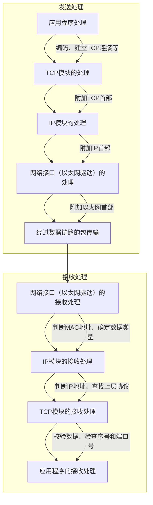

## 1. TCP/IP 出现的历史背景

1. **技术起源**：20世纪60年代，在计算机网络技术探索的大背景下，许多大学和研究机构都积极投身于新通信技术的研发。美国国防部（DoD）作为关键的推动力量，深刻认识到研发新通信技术对于国防军事的重大战略意义。在当时的冷战环境下，为确保国防通信在遭受敌方攻击和破坏时仍能保持畅通，DoD 支持开展相关研究。研究的核心目标是构建一种即使中央节点遭遇攻击，也能通过迂回线路实现最终通信，保证通信不中断的网络。在这样的需求驱动下，分组交换技术应运而生。该技术不仅在军工防卫方面展现出独特优势，还具备使多个用户在同一时间共享一条通信线路进行通信的能力，并且能降低搭建线路的成本，这吸引了大量研究人员投入到分组交换技术和分组通信的研究中。

   

   

2. **ARPANET诞生**：1969年，为了切实验证分组交换技术的实用性，研究人员搭建了一套具有开创性的网络，即最初的 ARPANET。起初，该网络仅连接了美国西海岸的大学和研究所等4个节点。随着美国国防部的重点关注和相关技术的飞速进步，ARPANET 迅速发展壮大，普通用户也逐渐被纳入其中。在短短3年时间里，ARPANET 从最初的4个节点迅猛发展成为拥有34个节点的超大规模网络。研究人员通过 ARPANET 进行的实验取得了前所未有的成功，有力地证明了基于分组交换技术的通信方法具备高度的可行性和巨大的发展潜力，ARPANET 也因此成为全球互联网的鼻祖。

3. **TCP/IP诞生**：ARPANET 的实验不仅仅局限于分组交换的验证，还肩负着在互连计算机之间提供可靠传输的综合性通信协议的研究任务。在20世纪70年代前半叶，ARPANET 中的一个研究机构成功研发出 TCP/IP。然而，从技术诞生到规范确立需要一个过程，直到1982年，TCP/IP 的具体规范才最终确定下来。1983年，TCP/IP 正式成为 ARPANET 网络唯一指定的协议，这标志着 TCP/IP 在网络通信领域的重要地位得以确立。

4. **UNIX系统普及与互联网扩张**：TCP/IP 的产生与发展，ARPANET 起到了至关重要的推动作用。但在 ARPANET 网络组建之初，由于节点数量有限，TCP/IP 的应用范围也受到一定程度的限制。1980年左右，ARPANET 中的众多大学与研究机构开始广泛使用一种名为 BSD UNIX 的操作系统。由于 BSD UNIX 率先实现了 TCP/IP 协议，这使得 TCP/IP 协议得以在实际应用中快速推广。1983年，TCP/IP 便被 ARPANET 正式采用，一些厂商也开始推出支持 TCP/IP 的产品。进入20世纪80年代，局域网迎来了快速发展的黄金时期，同时 UNIX 工作站也迅速普及，这一时期基于 TCP/IP 构建网络成为行业主流趋势。各大高校和研究机构纷纷将 ARPANET 连接到 NSFnet 网络，在此基础上，一个覆盖全球性范围的网络——互联网（The Internet）诞生了。随着互联网的发展，那些原本“各自为政”开发自己通信协议的网络设备供应商们，也逐渐开始遵循 TCP/IP 的规范，制造出兼容性更好的产品，以满足用户的需求。

5. **商用互联网服务启蒙**：研发互联网最初主要是用于实验和研究目的。然而，到了1990年，互联网逐渐从科研领域走向商业应用，被引入公司及一般家庭。与此同时，专门提供互联网接入服务的公司（ISP）应运而生，这一系列变化极大地推动了互联网的普及。随着互联网的普及，基于互联网技术的新型应用如雨后春笋般涌现，包括在线游戏、SNS、视频通信等。人们对拨号上网（当时个人电脑通信通过拨号实现）的需求日益增长，期望能够通过计算机实现更便捷的通信。但个人电脑通信服务存在一定局限性，如服务有限且多台电脑加入通信时操作方法各异。ISP 的出现解决了这些问题，由于 TCP/IP 在研究领域长期应用，积累了丰富的经验，人们对其商用价值充满期待。连接互联网后，人们可以通过 WWW 获取全球信息，通过电子邮件交流，向全世界发布消息，互联网作为一种不受会员限制的公共网络，让人们的生活更加丰富多彩。互联网作为商用服务迅速发展，到90年代，自由、开放的互联网以极快的速度被大众认可并广泛普及。

| 时间阶段                    | 关键事件                                                     |
| --------------------------- | ------------------------------------------------------------ |
| 20世纪60年代                | DoD 支持新通信技术研发，分组交换技术因军工需求及自身优势诞生，众多研究人员投入相关研究 |
| 1969年                      | 搭建最初只有4个节点的 ARPANET 验证分组交换技术，后迅速发展，成为互联网鼻祖 |
| 20世纪70年代前半叶 - 1983年 | ARPANET 研发出 TCP/IP，1982年规范确定，1983年成为 ARPANET 唯一指定协议 |
| 1980年左右 - 20世纪80年代   | BSD UNIX 实现 TCP/IP 协议，1983年被 ARPANET 采用，厂商推出产品，局域网和 UNIX 工作站发展，ARPANET 连接到 NSFnet 形成互联网，设备供应商顺应 TCP/IP 规范 |
| 1990年起                    | 互联网引入公司和家庭，ISP 出现，新型应用涌现，TCP/IP 商用价值受期待，互联网迅速普及 |

## 2. TCP\IP的标准化

- **TCP/IP的具体含义**：从字面理解，TCP/IP指TCP与IP两种协议，实际使用中常是利用IP进行通信时所用到的协议群统称，包括IP、ICMP、TCP、UDP、TELNET、FTP、HTTP等协议，这些协议与TCP或IP关系紧密，是互联网必不可少的部分，TCP/IP也被称为网际协议族。

  

- **TCP/IP标准化精髓**：TCP/IP标准化过程有两大特点，一是开放性，其协议由IETF（一个允许任何人加入讨论的组织）制定，成员通过电子邮件随时讨论；二是注重实用性，先实现能通信的技术，再制定规范。某个协议大致规范确定后，人们就在IETF中对协议及设备进行通信实验，发现问题继续讨论、修改和研究，最终形成规范。相比之下，OSI未普及是因为未能制定可行性强的协议、未及时应对技术革新、缺乏后期改良方案。

- **TCP/IP规范——RFC**：TCP/IP协议由IETF讨论制定，需标准化的协议列入RFC（Request For Comment）文档在互联网公布。RFC记录协议规范内容、标准化请求及实验信息，通过编号组织。协议规范修改需发布新RFC，老RFC作废，新RFC会明确规定扩展和作废的旧RFC。此外，用STD（Standard）管理编号记载协议规范状态，FYI（For Your Information）也标注编号组织，方便检索。截至2012年1月，部分协议的STD、RFC及状态如IP（v4）为标准，IP（v6）为草案标准等。

- **TCP/IP的标准化流程**：一个协议标准化需经IETF讨论，IETF每年组织3次会议，日常通过邮件组讨论且不限订阅。标准化流程分互联网草案阶段（有效期6个月，需在6个月内将讨论结果反映到草案，否则自动消除）、提议标准阶段（记入RFC）、草案标准阶段（至少4个月）、标准阶段。草案发布在互联网上，讨论和应用基于草案内容，充分讨论获IESG（IETF Engineering Steering Group）批准编入RFC成为提议标准，众多设备应用且获IESG认可成为草案标准，实际应用没问题且获IESG最终批准成为标准，未广泛应用则成提案标准。

  

- **提议标准与草案标准的实现**：推广只实现RFC中标准协议的产品不够，需实现草案协议和提议协议以抢先市场，规范修订后设备厂商应及时在产品中反映。

- **RFC的获取方法**：获取RFC最直接方法是通过互联网查询“RFC Editor”，网址为http://www.rfc-editor.org/rfc/ 、ftp://ftp.rfc-editor.org/in-notes/ ，这两个网址保存所有RFC文件，网站中有rfc-index.txt文件包含所有RFC的概览，还提供检索功能。此外，日本国内某些anonymous ftp服务器（如JPNIC的ftp服务器ftp://ftp.nic.ad.jp/rfc/ ）也存有RFC信息。 

## 3.互联网基础知识

- **互联网定义**：“互联网”英文“Internet”，字面原指将多个网络连接构成更大的网络，即网际网。如将两个以太网段用路由器相连是互联网，企业内部部门网络、公司内网与其他企业网相连，甚至区域网络互连形成的全球规模网络都可称互联网。现在“互联网”专指由ARPANET发展而来、互连全世界的计算机网络，英文“The Internet”已成为固有名词（Internet指网际网，The Internet指互联网，首字母大写）。

  

- **互联网与TCP/IP的关系**：互联网通信需要网络协议，TCP/IP是为使用互联网开发制定的协议族，互联网的协议就是TCP/IP，二者紧密相关。

- **互联网的结构**：互联网原意是网际网，由小范围网络相连组成机构内部网络，机构内部网络再相连成区域网络，区域网络互连形成全球规模的互联网，是有层次的网络。互联网中每个网络由骨干网（BackBone）和末端网（Stub）组成，网络间通过网络运营中心（NOC）相连，不同运营商的网络连接方式和使用方法不同，连接异构网络需互联网交换中心（IX）支持，互联网是众多异构网络通过IX互连的巨型网络。

- **ISP和区域网**：连接互联网需向互联网服务提供商（ISP）或区域网申请，公司或家庭申请入网联系ISP签约即可。不同ISP提供的互联网接入服务项目不同，如不限流量包月、限定上网时限、有线/无线网络连接等。区域网指特定区域内由团体或志愿者运营的网络，价格较便宜，但可能存在连接方式复杂或使用受限的情况。申请连网前，需确认ISP或区域网的具体服务条目、细节（如接入方式、条件、费用等），再结合自身使用目的决定。 

## 4. TCP/IP协议分层模型

- **硬件（物理层）**：TCP/IP的最底层是负责数据传输的硬件，相当于以太网或电话线路等物理层设备。由于人们在物理层面使用的传输媒介不同（如网线或无线），网络的带宽、可靠性、安全性、延迟等会有差异，且没有既定指标，TCP/IP是在网络互连设备能通信的前提下提出的协议。

- **网络接口层（数据链路层）**：利用以太网中的数据链路层进行通信，属于接口层，可看作让网络接口卡（NIC）起作用的“驱动程序”。驱动程序是在操作系统与硬件间起桥梁作用的软件，计算机的外围附加设备或扩展卡需相应驱动程序支持才能使用，如更换新NIC网卡，需硬件和软件配合。

- **互联网层（网络层）**：使用IP协议，相当于OSI模型中的第3层网络层，基于IP地址转发分包数据，将分组数据包发送到目的主机。IP是跨越网络传送数据包，使整个互联网都能收到数据的协议，用IP地址作为主机标识，能实现主机间通信，但不具有重发机制，属非可靠性传输协议。互联网层与传输层功能常由操作系统提供，尤其是路由器需实现通过互联网层转发分组数据包的功能，连接互联网的主机和路由器必须实现IP功能，其他网络设备（如网桥、中继器或集线器）不一定实现IP或TCP功能。此外，ICMP用于在IP数据包发送异常时发送通知，也用于诊断网络健康状况；ARP是从分组数据包的IP地址中解析出物理地址（MAC地址）的协议。

    

- **传输层**：有两个代表性协议，功能与OSI参考模型中的传输层类似，主要功能是让应用程序间实现通信，通过端口号识别哪些程序在进行通信。TCP是面向连接的传输层协议，能保证两端通信主机间的通信可达，处理传输中丢包、传输顺序乱掉等异常，有效利用带宽，缓解网络拥堵，但建立与断开连接时会产生网络流量浪费，适用于视频会议等场合。UDP是面向无连接的传输层协议，不关注对端是否收到数据，需在应用程序中实现检查功能，常用于分组数据较少或广播通信以及视频通信等多媒体领域。

- **应用层（会话层以上的分层）**：将OSI参考模型中的会话层、表示层和应用层的功能集中到应用程序中实现，多数应用架构属于客户端/服务端模型，提供服务的程序叫服务端，接受服务的程序叫客户端。常见应用包括：

    

    - **WWW**：互联网普及的重要动力，用户通过Web浏览器借助鼠标和键盘在网上获取信息，浏览器与服务器间通信协议是HTTP，传输数据主要格式是HTML，HTTP属于OSI应用层协议，HTML属于表示层协议。
    - **电子邮件（E-Mail）**：在网络上发送信件，使用SMTP协议发送邮件，最初只能发送文本格式邮件，MIME协议扩展后可发送多种格式信息。电子邮件与TCP/IP发展相辅相成，既方便讨论协议进度细节，也需完善网络环境和协议支持。
    - **文件传输（FTP）**：将文件在计算机硬盘间转移，使用FTP协议，传输时可选择二进制或文本方式，传输中建立两个TCP连接。
    - **远程登录（TELNET与SSH）**：登录到远程计算机使其程序运行，TCP/IP网络中常用TELNET和SSH协议，还有其他协议可实现此功能。
    - **网络管理（SNMP）**：在TCP/IP中采用SNMP协议进行网络管理，使用SNMP管理的设备称为SNMP代理（Agent），进行管理的一端叫管理器（Manager）。SNMP代理端保存网络接口等信息，可通过MIB访问，SNMP属于应用协议，MIB属于表示层协议，有助于管理员检查网络状况和发现故障。

总结如下表：
| 层次                       | 知识点                                                       |
| -------------------------- | ------------------------------------------------------------ |
| 硬件（物理层）             | TCP/IP最底层负责数据传输的硬件，类似以太网等物理层设备；因传输媒介不同，网络性能指标无既定标准，TCP/IP在网络互连设备可通信前提下提出 |
| 网络接口层（数据链路层）   | 利用以太网数据链路层通信，可看作NIC的“驱动程序”；驱动程序是操作系统与硬件间桥梁，外围设备需驱动程序支持 |
| 互联网层（网络层）         | 使用IP协议，基于IP地址转发分包数据；IP跨越网络传送数据包，以IP地址标识主机，无重发机制，属非可靠传输；ICMP用于发送异常通知和诊断网络；ARP解析IP地址对应的MAC地址；路由器等需实现IP功能 |
| 传输层                     | 有TCP和UDP两个代表性协议，功能是让应用程序通信，通过端口号识别；TCP面向连接，保证通信可达，处理异常，缓解拥堵，但有流量浪费；UDP面向无连接，不关注数据接收，用于多媒体等领域 |
| 应用层（会话层以上的分层） | 集中OSI模型会话层、表示层和应用层功能，多为客户端/服务端模型。 **WWW**：HTTP协议通信，HTML格式传输数据。 **电子邮件**：SMTP协议发送，MIME协议扩展格式。 **文件传输**：FTP协议，可选择传输方式，建立两个TCP连接。 **远程登录**：常用TELNET和SSH协议。 **网络管理**：SNMP协议管理，SNMP代理保存信息，通过MIB访问，SNMP属应用协议，MIB属表示层协议 |

## 5. TCP/IP分层模型与通信示例

1. **数据包首部**：在TCP/IP的每个分层中，发送数据时都会附加一个首部，首部包含该层必要信息，如目标地址和协议相关信息。不同术语用于表述数据单位，包是全能性术语，帧用于数据链路层，数据包用于网络层以上，段表示TCP数据流中的信息，消息指应用协议中的数据单位。数据包由协议首部和上层数据组成，首部结构由协议规范定义，通过首部可了解协议信息和处理内容。
2. **发送数据包**：以发送电子邮件“早上好”为例，从计算机A向计算机B发送邮件。
    - **应用程序处理**：启动应用程序新建邮件，输入内容，点击发送后开始TCP/IP通信。邮件会进行编码，如日文邮件用ISO-2022-JP或UTF-8编码，此为表示层功能。同时，邮件软件可能有同时发送多个邮件和接收新邮件的功能，这属于会话层功能。应用在发送邮件时建立TCP连接，将数据发送给下一层TCP。
    - **TCP模块的处理**：TCP根据应用指示，负责建立连接、发送数据和断开连接，提供可靠传输。在应用数据前端附加TCP首部，包含源端口号、目标端口号、序号和校验和等信息，然后将附加了TCP首部的包发送给IP。
    - **IP模块的处理**：IP将TCP首部和数据作为自己的数据，附加IP首部，包含接收端和发送端IP地址等信息。IP包生成后，路由器根据IP包路由表转发。若不知道接收端MAC地址，可利用ARP查找，找到后将MAC地址和IP地址交给以太网驱动发送。
    - **网络接口（以太网驱动）的处理**：从IP传来的IP包对以太网驱动来说是数据，附加以太网首部并发送，首部包含接收端和发送端MAC地址等信息，还会计算FCS添加到包尾。
3. **经过数据链路的包**：分组数据包经过以太网数据链路时，包会依次附加以太网首部、IP首部、TCP首部（或UDP首部）及应用首部和数据，最后追加以太网包尾。每个包首部包含发送端和接收端地址及上层协议类型信息，各分层通过这些信息识别包的发送端和接收端，以及上层协议类型。
4. **数据包接收处理**：
    - **网络接口（以太网驱动）的处理**：主机收到以太网包后，根据首部MAC地址判断是否发给自己，若是则根据类型域确定数据类型，如为IP包则传给处理IP的子程序，否则丢弃或传给其他协议处理。
    - **IP模块的处理**：IP模块收到IP包后，判断首部IP地址是否匹配，匹配则接收数据并查找上层协议，如为TCP则传给TCP处理，为UDP则传给UDP处理。有路由器时，需借助路由控制表转发。
    - **TCP模块的处理**：TCP模块计算校验和判断数据是否损坏，检查序号和端口号，确定应用程序。接收完毕后发送“确认回执”，若发送端未收到则重发。
    - **应用程序的处理**：接收端应用程序直接接收数据，解析后获取邮件收件人地址，若不存在则返回报错信息，若存在则保存邮件到硬盘，若保存失败则发送“处理异常”回执。
5. **SNS中的通信示例**：SNS即社交网络，是即时共享信息的服务。移动设备开机时由运营商设定IP地址，启动应用程序时连接指定服务器，经过用户名和密码验证后，服务器信息发送到终端显示。通过SNS可运行工具、发送文本动画等，基于TCP/IP应用，排查问题时需掌握TCP/IP知识。

邮件发送过程各层的流程图如下：

